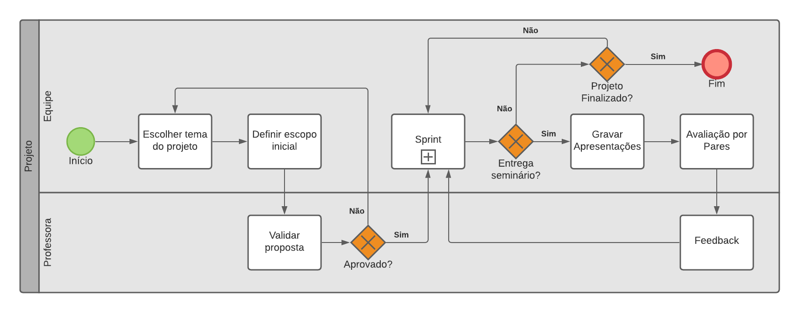
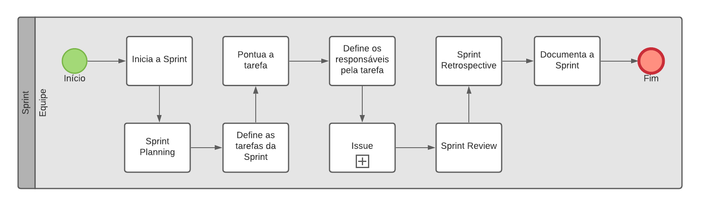

# Modelagem BPMN

## 1. Introdução

A Notação BPMN (Business Process Model and Notation) é um método de fluxograma que modela as etapas, de ponta a ponta, de um processo de negócios planejado. Peça-chave na gestão de processos de negócios, representa de forma visual uma sequência detalhada de atividades de negócios e fluxos de informação necessários para concluir um processo.

No projeto, a notação BPMN foi utilizada para documentar e especificar as etapas envolvidas na metodologia adotada pela equipe e os diagramas podem ser vistos abaixo.

## 2. Notação BPMN

| **BPMN01**    | **BPMN Projeto**                                   |
|---------------|---------------------------------------------------|
| **Descrição** | Modelagem BPMN para ilustrar o processo de desenvolvimento do projeto |
| **Autor**     | [Herick Portugues](https://github.com/herickport) |

| **BPMN02**    | **BPMN Sprint**                                   |
|---------------|---------------------------------------------------|
| **Descrição** | Modelagem BPMN para ilustrar o processo de desenvolvimento de uma sprint |
| **Autor**     | [Herick Portugues](https://github.com/herickport) |

| **BPMN03**    | **BPMN Issue**                                   |
|---------------|---------------------------------------------------|
| **Descrição** | Modelagem BPMN para ilustrar o processo de desenvolvimento de uma issue |
| **Autor**     | [Herick Portugues](https://github.com/herickport) |

## 3. Referências

> - HEFLO. O que é BPMN? A notação mais usada para modelar processos. Disponível em: https://www.heflo.com/pt-br/bpm/notacao-bpmn/. Acesso em 05 de Agosto de 2021.

> - Lucidchart. O Que É BPMN | Lucidchart. Disponível em: https://www.lucidchart.com/pages/pt/o-que-e-bpmn. Acesso em 05 de Agosto de 2021.

## Histórico de Revisões

|    Data    | Versão | Descrição |         Autor(es)          |
| :--------- | :----- | :-------- | :------------------------- |
| 05/08/2021 |  1.0   | Elaboração dos diagramas BPMN        | [Herick Portugues](https://github.com/herickport) |
| 06/08/2021 |  1.1   | Criação da primeira versão documento | [Herick Portugues](https://github.com/herickport) |