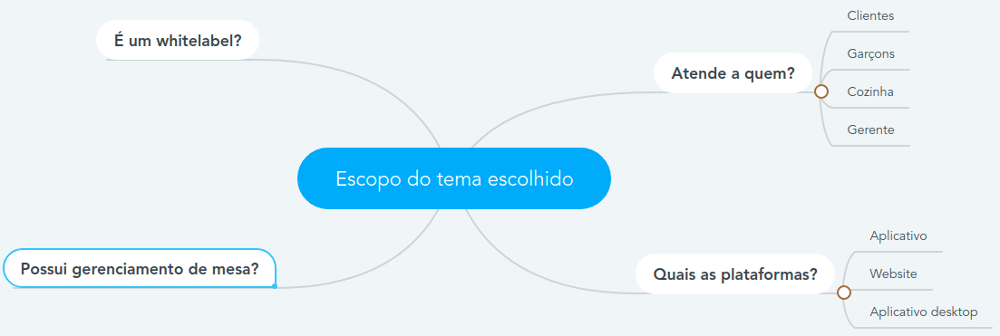

# Design Sprint

## 1. Introdução

O Design Sprint é um processo de 5 dias para responder as questões críticas de negócios através do desenho, prototipação e testes de ideias com usuários. Trabalhando juntos em uma sprint, é possível utilizar este atalho para evitar um ciclo de debates sem fim. Assim, os meses de trabalho são reduzidos para uma única semana. Em vez de esperar o lançamento de uma MVP para entender se uma ideia é boa, o feedback é obtido instantaniamente através de um protótipo realista. É importante apontar que, durante essa metodologia, são desenvolvidos vários artefatos que vamos apontar neste documento.
Para o nosso projeto, foi escolhido a forma mais rápida de realizar a metodologia, transformando os dias de sprint em minutos de reunião e discussões durante o dia utilizando a ferramenta Telegram, porém os passos continuam os mesmo, exceto os passos de testes, que vão ser adiados por agora.

## 2. Passo a passo

### 2.1. Unpack

Nesta etapa o foco total é ter um compilado de insights, onde todos os membros participaram dando ideias de temas de projeto e avaliando as ideias dos outros membros do grupo. Utilizamos a técnica de barinstorming para atingir os resultados desta etapa, que estão sendo mostrados abaixo:

### 2.2. Sketch

Aqui o foco é desenhar as ideias levantadas na etapa anterior, desenvolvendo alguns artefatos como Rich Picture para ajudar na exemplificação da ideia por cada integrante do grupo. Para facilitar a organização do documento, todos os artefatos desenvolvidos irão estar linkados em um tópico específico para isso no decorrer do documento.

### 2.3. Decision

Nesta etapa o objetivo é escolher a melhor ideia com base nos artefatos desenvolvidos. Também temos como foco desenvolver um storyboarding, que guiará o desenvolvimento do protótipo.

### 2.4. Prototype

Aqui irá acontecer a elaboração do protótipo da ideia escolhida. Aqui s eutiliza o que é chamado de "realistic looking" para se ter um protótipo bem fidedigno à solução desejada.

## 3. Propostas de temas analisadas

### Ideias de temas

### 3.1. Assistente virtual focado na saúde mental do usuário

<b>Situação problema</b>
Muitas pessoas sentem dificuldade psicologicamente de ficar em casa por muito tempo e quando precisam ficar, na situação atual, sofrem problemas para se manterem saudáveis mentalmente.

<b>Solução</b>
Um assistente virtual que tem como foco auxiliar o usuário a manter sua saúde mental atravé de diversas atividades e recomendações.

### 3.2. Sistema gerenciador de plugins para o editor de texto Micro

<b>Situação problema</b> 
O gerenciamento de plugins do editor de texto Micro é muito problemático atualmente, ocorrendo dentro do github onde o dono do repositório aceita manualmente cada plugin, o que deixa o processo lento e inviável.

<b>Solução</b> 
Sistema de gerenciamento de plugins para o editor de texto. Um sistema independente, que possibilitaria publicar qualquer plugin apenas tendo uma conta dentro do serviço.

### 3.3. Sistema gerenciador de pedidos e mesas de um restaurante

<b>Situação problema</b> 
Ineficiencia de atendimento em alguns restaurantes, fazendo com que haja demora para ocorrer os atendimentos e sujeitando pedidos a erros devido a desatenção de atendentes.

<b>Solução</b> 
Um sistema gerenciador de pedidos e mesas que permita que pedidos sejam feitos diretamente por eles, sem a necessidade da intervenção de um atendente. Agilizando o processo e blindando o mesmo de falhas de funcionários, trazendo uma melhor experiência para os consumidores.

<b>Principais funcionalidades</b> 
APP DO CLIENTE: 

- Login da mesa 
- Listagem do cardápio do restaurante 
- Chamar garçom/atendente 
- Realizar pedidos por pessoa ou pela mesa 
- Editar pedido 
- Mostrar extrato de pedidos 
- Dividir a conta por pessoa ou por valores iguais  

APP DO GARÇOM: 

- Login do garçom 
- Controle de mesas que está atendendo 
- Notificado quando chamado à alguma mesa 
- Listar o extrato do pedido de cada mesa que está atendendo  

APP DA COZINHA: 

- Listagem dos pedidos a serem preparados 

## 4. Escolha do tema

A escolha do tema foi dada levando em consideração o contexto e o escopo de cada proposta. Abaixo será exemplificado o porquê de cada proposta ter sido recusada/aceita.

### 4.1. Proposta 1 (Gerenciamento de plugins)

Esta proposta foi recusada devido ao escopo do projeto. Alguns integrantes acharam outras ideias mais interessantes, outros integrantes tiveram dúvidas sobre como seria a implementação da ideia e de como seria mostrado ao usuário essa implementação. Devido a esses fatores foi decidido pelo grupo de recusar esta proposta de tema.

### 4.2. Proposta 2 (Assistente Virtual)

Esta proposta foi recusada devido à pouca definição das principais funcionalidades e devido à área técnica do tema. Não ficou totalmente claro de como a solução iria ajudar o usuário a manter sua saúde mental, e como nenhum integrante do grupo tinha propriedade intelectual no assunto, existia a necessidade de trazer terceiros na especificação da solução, o que dificultaria o processo. Outro ponto importante foi o fato de termos uma proposta já muito bem acolhida, que foi a proposta escolhida, o que levou a recusa deste tema.

### 4.3. Proposta 3 (Sistema gerenciador de pedidos)

Esta proposta foi escolhida devido ao tema da proposta, que foi acolhida por todos os membros do grupo, seu escopo de fácil implementação e fácil modularização, assim também como uma boa ideia de produto real, devido a varios problemas de soluções já implementadas no mercado.

#### Escopo do tema escolhido

## 5. Artefatos desenvolvidos

### 5.1. Brainstorming

Brainstorming é uma técnica que fornece informações sobre os tipos de conteúdos e características que os usuários querem e desejam em um produto. (Courage e Baxter, 2005)

A sessão começa com uma pergunta que resume o objetivo de entender o que os usuátios querem e precisam, e pode ser conduzida em aproximadamente uma hora. Nela deve haver um moderador resposável por fazer as perguntas e registrar as ideias dos participantes. Os resultados dessa atividade podem servir diretamente a especificação funcional e documentação de design.

### 5.2. Rich Pictures

Trata-se de uma forma de modelagem de ideias, pouco formal, e ideal para reuniões com clientes e/ou em times de desenvolvimento. Baseia-se em rascunhar desenhos e usar textos curtos e objetivos para expressar um momento, um desejo, uma atividade, dentre outras necessidades. Os desenhos podem ser feitos à mão livre ou via um software. Idealmente, são feitos, no momento da reunião, à mão livre.
Essa técnica de anotação é prática, útil, e facilita registrar momentos e impressões junto aos interessados. Isso contribuiu para com o levantamento dos requisitos, uma das primeiras atividades da Engenharia de Requisitos. Mas também pode ser utilizada em tempo de projeto/design.

### 5.3. 5W2H

É um conjunto de questões utilizadas para compor planos de ação de maneira rápida e eficiente. Seu principal propósito é a definição de tarefas eficazes e seu acompanhamento, de maneira visual, ágil e simples.

<b>Definições:</b> 
What - O que deve ser feito? 
Why - Por que deve ser implementado? 
Who - Quem é o responsável pela ação? 
Where - Onde deve ser executado? 
When - Quando deve ser implementado? 
How - Como deve ser conduzido? 
How much - Quanto vai custar a implementação?

### 5.4. Diagrama de Ishikawa

É uma diagramação que analisa, sob diferentes pontos de vista, uma série de causas que podem lear a um dado efeito. Utilizado para analisar um problema ou risco e suas possíveis causas.

### 5.5. Estudo de Benchmarking

É um estudo feito para analisar soluções similares do mercado com a proposta de produto, analisando diversos fatores como requisitos básicos e diferenciais entre um e outro. Sempre absorvendo os pontos positivos das soluções já existentes e aprendendo com os pontos negativos, melhorando a solução que irá ser construída.

### 5.6. Questionários

A elicitação por meio de questionários é uma das técnicas que permite maior alcance já que lida com grande número de participantes e possibilita, de forma geral, a coleta de diversos tipos de dados tanto quantitativos quanto qualiativos. O planejamento e a metodologia utilizada para a criação dos quesstionários deve ser bem estruturada e priorizar a compreensão dos voluntários em relação a cada aspecto posto em estudo pelas questões.

Devido a possibilidade de levantar estatísticas sobre os grupos de usuários, os questionários são amplamente utilizados mas ainda sim possuem a desvantagem de não poder lidar com questões muito subjetivas quando se trata de um público maior. Conforme aumenta a quantidade de voluntários aos quais os questionários serão submetidos, mais complexa se torna a tarefa de analisar cada uma das respostas caso sejam abertas e passiveis de interpretação.

### 5.7. Entrevistas

A entrevista é uma forma de diálogo, formal ou informal, entre duas ou mais pessoas, onde o entrevistador busca respostas para um conjunto de questões previamente planejadas e os entrevistados se apresentam como fontes de informação. Trata-se, portanto, de uma técnica mais flexível, que aproxima o engenheiro de requisitos do usuário do sistema, permitindo adquirir informações de caráter subjetivo. Dessa forma, é uma técnica muito utilizada na elicitação de requisitos para encontrar os requisitos ideias para o sistema.

### 5.8. Storytelling

Storytelling é um termo em inglês, que significa contar história. Pode ser definda como uma técnica de elicitação de requisitos que tem como principal característica a criação de uma ou mais histórias que ilustram as necessidades do usuário de forma que seja possível notar as ações do cotidiano e perceber as principais necessidades que o sistema deverá atender, empregando sempre técnicas de contagem de histórias motivadoras com uma linguagem simples durante o processo de construção.

Devido ao cenário atual de ensino remoto, a técnica oferece facilidade em sua realização pois não necessita que todos os participantes estejam no mesmo lugar, nem presentes ao mesmo tempo.

### 5.9. NFR

O NFR Framework é uma abordagem para representar e analisar Requisitos Não-Funcionais. Seu objetivo é ajudar desenvolvedores na implementação de soluções personalizadas, levando em consideração as características do domínio e do sistema em questão. Tais características incluem Requisitos Não-funcionais, Requisitos funcionais, prioridades e carga de trabalho. Esses fatores determinam a escolha de alternativas de desenvolvimento para um determinado sistema (CHUNG et al., 2000). O modelo utilizado no NFR Framework é chamado Softgoal Interdependency Graph (SIG).

### 5.10. Protótipo

A prototipagem auxilia no entendimento do potencial cliente em relação à solução proposta a ele. Ele é a ferramenta mais concreta antes da produção do produto, sendo possível realizar diversas correções e aprimoramentos para aumentar a qualidade.

## 6. Referências

> - The Design Sprint. Disponível em: [aqui](https://www.gv.com/sprint/). Acesso em: 01 de agosto de 2021.

> - QR Comer. Design Sprint. Disponível em: [aqui](https://fga-desenho-2019-2.github.io/Wiki/seminario1/design_sprint/). Acesso em: 01 de agosto de 2021

> - Chief of design. Design Sprint – O que é e para que serve o Design Sprint Google?. Disponível em: [aqui](https://www.chiefofdesign.com.br/design-sprint/). Acesso em: 01 de agosto de 2021.

> - Slides Arquitetura e Desenho de Software. Aula Projeto e Desenho de Software. Profa. Milene Serrano. Pg 12-23, 42-44. Disponível em: [aqui](https://aprender3.unb.br/pluginfile.php/897124/mod_label/intro/Arquitetura%20e%20Desenho%20de%20software%20-%20Aula%20Projeto-DSW%20-%20Profa.%20Milene.pdf). Acesso em: 01 de agosto de 2021.

> - Projeto Requisitos de Software. Telegram. Disponível em: [aqui](https://requisitos-de-software.github.io/2020.2-Telegram/). Acesso em: 01 de agosto de 2021.

## Histórico de Revisões

| Data       | Versão | Descrição                                | Autor(es)                                                                                    |
| :--------- | :----- | :--------------------------------------- | :------------------------------------------------------------------------------------------- |
| 01/08/2021 | 1.0    | Criação da primeira versão do documento  | [Tiago Samuel](https://github.com/tsrrodrigues)                                              |
| 03/08/2021 | 1.1    | Arrumando paths das imagens              | [Emily Dias](https://github.com/emysdias), [Brenda Santos](https://github.com/brendavsantos) |
| 04/08/2021 | 1.2    | Arrumando espaçamento e path das imagens | [Emily Dias](https://github.com/emysdias), [Brenda Santos](https://github.com/brendavsantos) |
