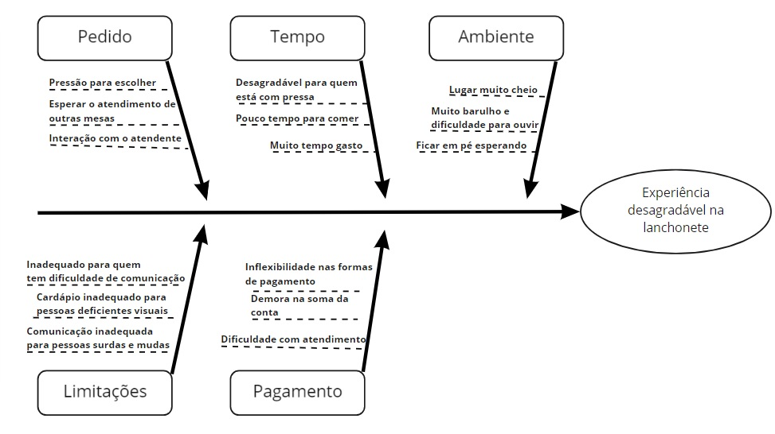

# Diagrama de Ishikawa

## 1. Introdução

Diagramas de causa e efeito (ou diagrama de Ishikawa) são diagramas causais que mostram as causas potenciais de um evento específico. A ferramenta é usada para encontrar, organizar, classificar, documentar e exibir graficamente as causas de um determinado problema, agrupados por categorias, que facilitam o brainstorming de ideias e análise da ocorrência. Cada causa ou motivo de imperfeição é uma fonte de variação. As causas geralmente são agrupadas em categorias principais para identificar e classificar essas fontes de variação.

## 2. Diagrama

## 3. Referências

> - Diagrama de Ishikawa. Disponível em: https://blogdaqualidade.com.br/diagrama-de-ishikawa. Acesso em: 01 ago 2021;

> - Diagrama de Ishikawa - Ferramentas de Qualidade. Disponível em: https://ferramentasdaqualidade.org/diagrama-de-ishikawa/. Acesso em: 01 ago 2021.

## Histórico de Revisões

| Data       | Versão | Descrição            | Autor(es)                                    |
| :--------- | :----- | :------------------- | :------------------------------------------- |
| 01/08/2021 | 0.1    | Criação do documento | [Ítalo Alves](https://github.com/alvesitalo) |
| 03/08/2021 | 0.2    | Revisão do documento | [Daniel Primo](https://github.com/danieldagerom) |
