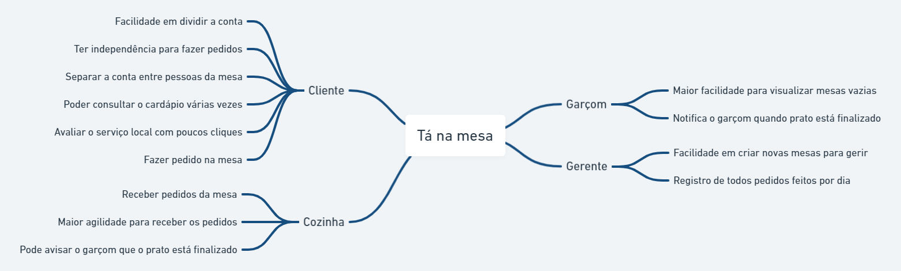

# Mapa mental

## 1. Introdução

&emsp;&emsp; Mapa mental é uma forma de delinear estratégias já que reduz a carga de informações e traduz elas em formas visuais e partes gerenciáveis, insights. A técnica utiliza diagramas, balões, linhas e textos coloridos para organizar as ideias visualmente, e pode ser feita direto no papel ou digitalmente. No nosso caso em específico, foi utilizado o "whimsical", ferramenta que auxilia bastante na criação de diagramas.

## 2. Mapa mental

&emsp;&emsp; Para a realização do nosso Mapa mental, nos baseamos nos brainstormings gerados a partir de reuniões guiadas, com isso conseguimos tirar toda a carga de informações e estruturá-las de forma mais visual, garantindo assim um maior proveito das ideias.

### 2.1 Mapa mental para o tema do projeto

### 2.2 Mapa mental para escopo do tema

### 2.3 Mapa mental para possíveis funcionalidades do produto

## 3. Referências

> - Mapas mentais: o que são e como fazer? Crie agora mesmo!. [SARA MCGUIRE]. Disponível em: https://pt.venngage.com/blog/modelos-de-mapas-mentais/. Acesso em: 05 de Agos. 2021.

## Histórico de Revisões

| Data       | Versão | Descrição                        | Autor(es)                                   |
| :--------- | :----- | :------------------------------- | :------------------------------------------ |
| 05/08/2021 | 1.0    | Criação do Documento mapa mental | [Abner Filipe](https://github.com/abner423) |
