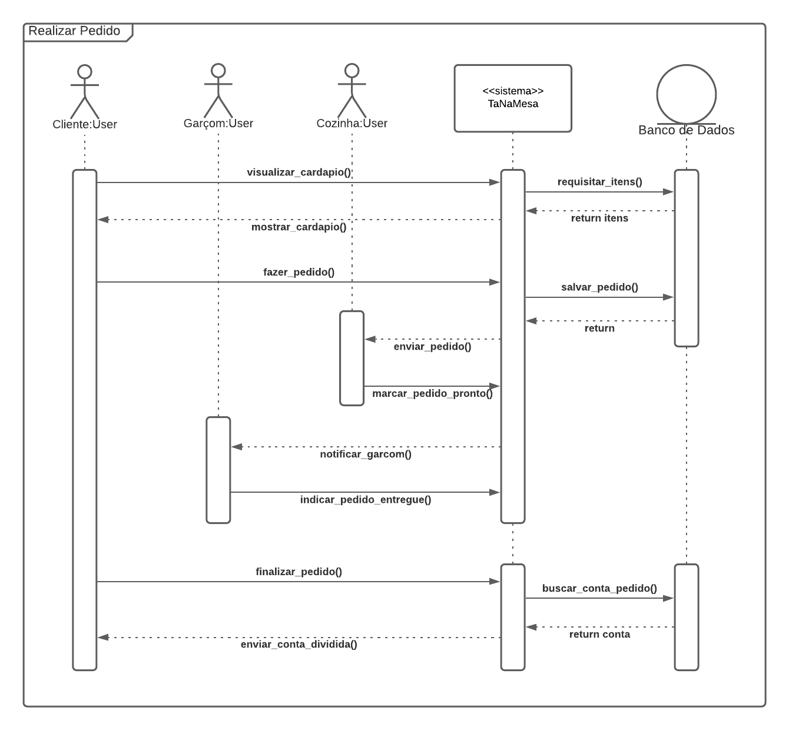

# Diagrama de Sequência

## 1. Introdução

Um diagrama de sequência tem como objetivo principal representar graficamente o comportamento de uma funcionalidade, considerando a interação entre todos os componentes relacionados ao seu uso (Até o Momento, 2021).

## 2. Metodologia

O diagrama a seguir usa a notação UML sequêncial para descrever o fluxo de funcionamento do pedido, com suas interações entre cliente, garçom, cozinha e sistema.

Para o desenvolvimento do diagrama foi utilizado as ferramentas do site [LucidChart](lucidchart.com/), por possuir os métodos e design padrão das representações do diagrama, ser de fácil acesso e permitir compartilhamento para desenvolvimento simultâneo.

## 3. Diagramas

### 3.1. Realizar Pedido

<figcaption>Figura 1. Resultado do diagrama de sequência da aplicação.</figcaption>

| **DS01**      | **Diagrama de Sequência - Realizar Pedido**                                                          |
| ------------- | ---------------------------------------------------------------------------------------------------- |
| **Descrição** | Fluxo de realização do pedido, com os atores Cliente, Garçom e Cozinha                               |
| **Autor**     | [Daniel Primo](https://github.com/danieldagerom) e [Herick Portugues](https://github.com/herickport) |

## 4. Referências

> - SERRANO, Milene. Arquitetura e desenho de software - 06a - VídeoAula - DSW - Modelagem - Diagrama de Sequência. Acesso em: 21 de Agosto de 2021.
> - Lucidchart. O que é um diagrama de sequência UML?. Disponível em: <https://www.lucidchart.com/pages/pt/o-que-e-diagrama-de-sequencia-uml>. Acesso em: 21 de agosto de 2021.
> - Até o Momento. Entendendo o Diagrama de Sequência da UML. Disponível em: <https://www.ateomomento.com.br/diagrama-de-sequencia-uml/>. Acesso em: 22 de agosto de 2021.
> - UML Diagrams Org. Sequence Diagram. Disponível em: <https://www.uml-diagrams.org/sequence-diagrams.html> Acesso em: 21 de agosto de 2021.

## Histórico de Revisões

| Data       | Versão | Descrição                                       | Autor(es)                                                                                            |
| :--------- | :----- | :---------------------------------------------- | :--------------------------------------------------------------------------------------------------- |
| 22/08/2021 | 1.0    | Elaboração do diagrama                          | [Daniel Primo](https://github.com/danieldagerom) e [Herick Portugues](https://github.com/herickport) |
| 22/08/2021 | 1.1    | Criação do documento                            | [Daniel Primo](https://github.com/danieldagerom) e [Herick Portugues](https://github.com/herickport) |
| 23/08/2021 | 1.2    | Revisa o documento e adiciona legenda na imagem | [Lucas Boaventura](https://github.com/lboaventura25)                                                 |
| 23/08/2021 | 1.3    | Revisão do documento                            | [Emily Dias](https://github.com/emysdias)                                                            |
| 23/08/2021 | 1.4    | Revisa o documento                              | [Eduarda Servidio](https://github.com/ServideoEC)                                                         
