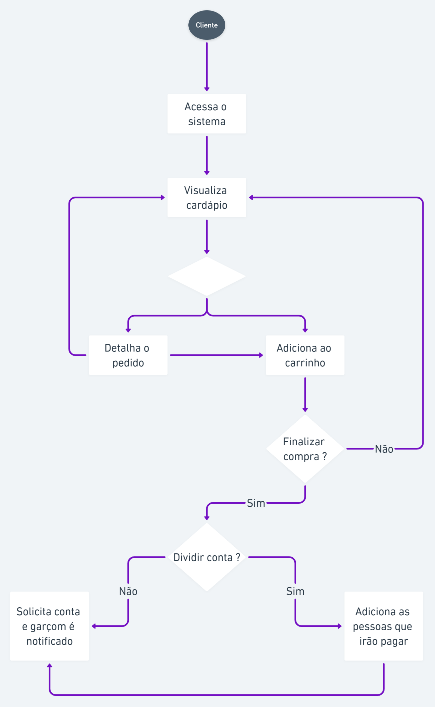
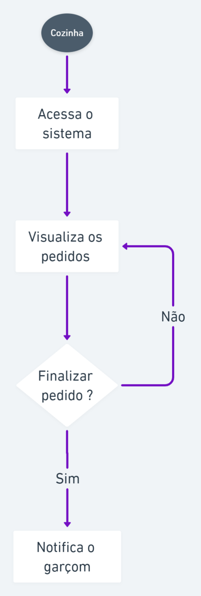
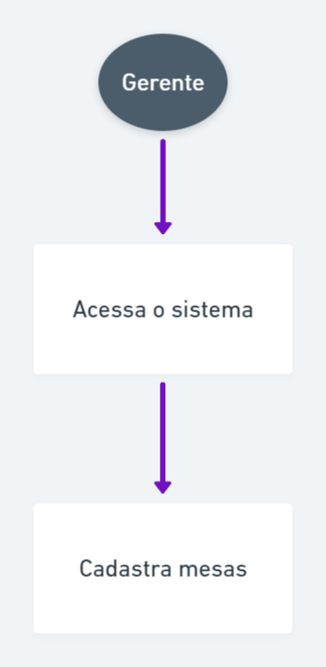

# Diagrama de Atividades

## 1. Introdução

O digrama de atividades é considerado um diagrama de comportamento porque descreve o que é necessário acontecer no sistema sendo modelado, e tem por objetivo mostrar o fluxo de atividades em um único processo. Os diagramas ajudam a unir as pessoas das áreas de negócios e de desenvolvimento de uma organização para entender o mesmo processo e comportamento. Para a criação dos diagramas foi utilizado o "whimsical", ferramenta que auxilia bastante.

### 2. Diagramas

#### 2.1. Diagrama de Cliente

| **DAF01**     | **Diagrama de Cliente**                     |
| ------------- | ------------------------------------------- |
| **Descrição** | Descrição do fluxo de cliente               |
| **Autor**     | [Abner Filipe](https://github.com/abner423) |

#### 2.2. Diagrama da Cozinha

| **DAF02**     | **Diagrama da Cozinha**                     |
| ------------- | ------------------------------------------- |
| **Descrição** | Descrição do fluxo da cozinha               |
| **Autor**     | [Abner Filipe](https://github.com/abner423) |

#### 2.3. Diagrama do Garçom

| **DAF03**     | **Diagrama do Garçom**                      |
| ------------- | ------------------------------------------- |
| **Descrição** | Descrição do fluxo do garçom                |
| **Autor**     | [Abner Filipe](https://github.com/abner423) |

#### 2.4. Diagrama do Gerente

| **DAF04**     | **Diagrama do Gerente**                     |
| ------------- | ------------------------------------------- |
| **Descrição** | Descrição do fluxo do gerente               |
| **Autor**     | [Abner Filipe](https://github.com/abner423) |

## 3. Referências

> - SERRANO, Milene. Arquitetura e desenho de software - 06c - VídeoAula - DSW - Modelagem - Diagrama de Atividades
> - O que é diagrama de atividades UML? Lucidchart. Disponível em: <https://www.lucidchart.com/pages/pt/o-que-e-diagrama-de-atividades-uml/#section_5>. Acesso em: 15 de out. de 2021.
> - Diagrama de Atividades. Dsc Ufcg Edu. Disponível em: <http://www.dsc.ufcg.edu.br/~jacques/cursos/map/html/uml/diagramas/atividades/diag_atividades.htm>. Acesso em: 15 de out. de 2021.

## Histórico de Revisões

| Data       | Versão | Descrição                         | Autor(es)                                   |
| :--------- | :----- | :-------------------------------- | :------------------------------------------ |
| 14/08/2021 | 1.0    | Criação dos diagramas             | [Abner Filipe](https://github.com/abner423) |
| 15/08/2021 | 1.1    | Adição do documento e dos tópicos | [Emily Dias](https://github.com/emysdias)   |
