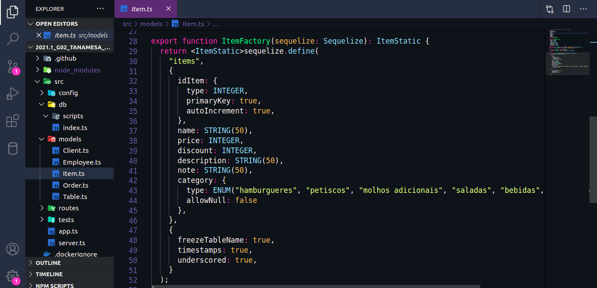

# Padrões de Projeto Emergentes Adotados no Projeto

## 1. Introdução

Os Padrões emergentes são mais ligados a plataformas e tecnologias da atualidade. Abaixo segue alguns padrões que estão sendo utilizados no projeto.

## 2. MVC

É um padrão de arquitetura de software responsável por contribuir na otimização da velocidade entre as requisições feitas pelo comando dos usuários. A sigla MVC significa Model ou Modelo, View ou Visão e por último Controller ou Controlador.

Este padrão ajuda na tarefa de separar as responsabilidades promovendo um baixo acoplamento e alta coesão, tornando o sistema escalável.

### 2.1. Benefícios

- Separação muito clara entre as camadas de visualização e regras de negócios;
- Manutenção do sistema se torna mais fácil.
- Reaproveitamento de código, principalmente da camada de modelo, que pode ser reutilizada em outros projetos.
- As alterações na camada de visualização não afetam as regras de negócios já implementadas na camada de modelo.
- Mais segurança para a aplicação onde a controller funciona como uma espécie de filtro capaz de impedir que qualquer dado incorreto chegue até a camada modelo.

### 2.2. Utilização no projeto

#### Model

<figcaption>Figura 1. Exemplo de Model</figcaption>

## 3. Component Pattern 
A padronização de componentes no React visa dividir a interface em partes independentes e reutilizáveis, de forma que cada parte seja tratada como bloco isolado, livre de outras dependências externas. Os componentes aceitam entradas e retornam elementos React que descrevem o que deve aparecer na tela.

### 3.1. Benefícios
* Baixo acoplamento
* Alta coesão
* Viabiliza a reutilização de código

### 3.2. Utilização no projeto

#### Componente

<figcaption>Figura 2. Exemplo de Componente</figcaption>

## 3. Referências Bibliográficas

> - Higor. Introdução ao padrão MVC. Devmedia, 2013. Disponível em: <https://www.devmedia.com.br/introducao-ao-padrao-mvc/29308>. Acesso em: 11/09/2021.
> - BAPTISTELLA, Adriano José. Abordando a arquitetura MVC, e Design Patterns: Observer, Composite, Strategy. Linhadecódigo. Disponível em: <http://www.linhadecodigo.com.br/artigo/2367/abordando-a-arquitetura-mvc-e-design-patterns-observer-composite-strategy.aspx>. Acesso em: 11/09/2021.
> - Marcio. Padrão MVC - Java Magazine. Devmedia, 2011. Disponível em: <https://www.devmedia.com.br/padrao-mvc-java-magazine/21995>. Acesso em: 11/09/2021.

## Histórico de Revisões

| Data       | Versão | Descrição                        | Autor(es)                                 |
| :--------- | :----- | :------------------------------- | :---------------------------------------- |
| 11/09/2021 | 1.0    | Adicionando tópicos do documento | [Emily Dias](https://github.com/emysdias) |
| 13/09/2021 | 1.1    | Complementando documento e revisando | [Brenda Santos](https://github.com/brendavsantos) |
| 19/09/2021 | 1.2    | Pequena correção ortográfica e revisão do documento | [Eduarda Servidio](https://github.com/ServideoEC), [Sergio Cipriano](https://github.com/sergisacj) |
| 19/09/2021 | 2.0   | Revisa o documento e adiciona legendas nas imagens | [Lucas Boaventura](https://github.com/lboaventura25) |
