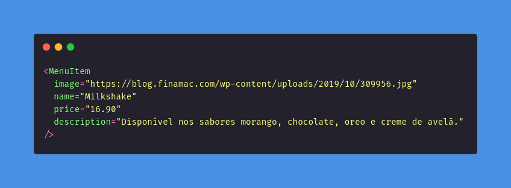

# Padrões de Projeto GoFs Criacionais Adotados no Projeto

## 1. Introdução
"Os padrões de criação abstraem o processo de instanciação. Eles ajudam a tornar um sistema
independente de como seus objetos são criados, compostos e representados. Um padrão de
criação de classe usa a herança para variar a classe que é instanciada, enquanto que um
padrão de criação de objeto delegará a instanciação para outro objeto. Os padrões
de criação se tornam importantes à medida que os sistemas evoluem no sentido de depender
mais da composição de objetos do que da herança de classes." (GAMMA, 2000). Ou seja, 
os GoFs Criacionais são relativos à criação de objetos, à criação de classes e a processos de instanciação.

Este documento tem como objetivo elencar padrões de projeto criacionais que foram utilizados no projeto,
contando com a definição do padrão, justificativa de uso e exemplo de código. A escolha dos padrões adotados
se deu a partir de uma reunião realizada no dia 30/08/2021 e que contou com a presença de todos os membros do grupo.

## 2. Princípios e Padrões

### 2.1. Factory Method
### 2.1.1. Definição

O padrão Factory Method fornece uma interface para criar objetos em uma superclasse, 
mas permite que as subclasses alterem o tipo de objetos que serão criados. Assim, o padrão
sugere que chamadas diretas de construção de objetos sejam substituídas por chamadas
para um método *fábrica* especial (Refactoring.Guru). Dessa forma, a ideia é encapsular
a escolha da classe concreta que será utilizada na criação de um determinado objeto.

### 2.1.2. Uso no Projeto

**Justificativa**: Este padrão de projeto foi aplicado no BackEnd para a criação de models no Node.js,
utilizando a biblioteca sequelize.

No código abaixo, temos um exemplo da criação da model Client, utilizando sequelize:

<figcaption>Figura 1. Exemplo do padrão GoFs de Factory</figcaption>

### 2.2. Singleton
### 2.2.1. Definição

O padrão Singleton é um padrão de projeto criacional que permite a criação de apenas uma
instância de uma classe, provendo um ponto de acesso global para essa instância.

### 2.2.2. Uso no Projeto

**Justificativa**: Alguns dos usos do padrão Singleton no projeto são o localStorage, 
utilizado para gerenciar o tema da aplicação no FrontEnd, além de garantir uma instância
única da aplicação e do banco de dados no BackEnd.

No código abaixo, é exemplificado a criação da Classe App, exportando uma única
instância.

<figcaption>Figura 2. Exemplo do padrão GoFs de Singleton</figcaption>

### 2.3. Multiton

### 2.3.1. Definição

O padrão Multiton é um padrão de projeto criacional que generaliza o padrão Singleton. Enquanto
o Singleton permite a criação de apenas uma instância de uma classe, o padrão Multiton permite
a criação de uma quantidade controlada de instâncias e fornece um modo para recuperá-las.

### 2.3.2. Uso no Projeto

**Justificativa**: Uma das aplicações no projeto será no FrontEnd com o uso de componentes do React,
em que será possível instanciar diversos componentes iguais, mas que possuem informações diferentes.

No código abaixo, é exemplificado a criação de itens do cardápio, utilizando um componente:

<figcaption>Figura 3. Exemplo do padrão GoFs de Multiton</figcaption>

## 3. Referências

> - REFACTORING GURU. Factory Method. Disponível em: <https://refactoring.guru/design-patterns/factory-method>. Acesso em 30 de ago. de 2021.

> - REFACTORING GURU. Singleton. Disponível em: <https://refactoring.guru/design-patterns/singleton>. Acesso em 30 de ago. de 2021.

> - SERRANO, Milene. Arquitetura e desenho de software. Módulo Padrões de Projeto GoF(s) Criacionais - Material em Slide. Acesso em: 30 de Agosto de 2021.

> - SERRANO, Milene. Arquitetura e desenho de software. Módulo Padrões de Projeto GoF(s) Criacionais - 08a - Vídeo-Aula - DSW - GoFs - Criacionais. Acesso em: 30 de Agosto de 2021.

> - WIKIPEDIA. Multiton pattern. Disponível em: <https://en.wikipedia.org/wiki/Multiton_pattern>. Acesso em 30 de ago. de 2021.

> - GAMMA, Erich; HELM, Richard; JOHNSON, Ralph; VLISSIDES, John. "Padrões de projeto: soluções reutilizáveis de software orientado a objetos". Artmed Editora S.A, 2000.

## Histórico de Revisões

|    Data    | Versão | Descrição       | Autor(es)     |
| :--------- | :----- | :-------------- | :------------ |
| 29/08/2021 | 1.0    | Criação do documento e desenvolvimento dos tópicos builder, object pool e abstract factory     | [Eduarda Servidio](https://github.com/ServideoEC)           |
| 30/08/2021 | 1.1    | Adição dos padrões Factory Method, Singleton e Multiton | [Herick Portugues](https://github.com/herickport) |
| 30/08/2021 | 1.1.1  | Reunião para definir os padrões utilizados | Todos os integrantes |
| 05/09/2021 | 1.2    | Atualização dos padrões que serão utilizados | [Eduarda Servidio](https://github.com/ServideoEC) e [Herick Portugues](https://github.com/herickport) |
| 05/09/2021 | 1.3    | Adição tópico introdução | [Eduarda Servidio](https://github.com/ServideoEC) |
| 06/09/2021 | 1.4    | Atualização nas justificativas e correção de referências | [Herick Portugues](https://github.com/herickport) |
| 19/09/2021 | 1.5    | Revisão do documento | [Sergio Cipriano](https://github.com/sergiosacj), [Brenda Santos](https://github.com/brendavsantos) |
| 20/09/2021 | 1.6    | Adição de códigos referentes aos padrões | [Eduarda Servidio](https://github.com/ServideoEC) e [Herick Portugues](https://github.com/herickport)|
| 20/09/2021 | 2.0    | Atualização da introdução e refatoração dos códigos e justificativas | [Herick Portugues](https://github.com/herickport) |
| 20/09/2021 | 2.1    | Alterando exemplo do padrão Singleton | [Herick Portugues](https://github.com/herickport) |
| 20/09/2021 | 3.0    | Adição de imagens e revisão do documento | [Lucas Boaventura](https://github.com/lboaventura25) |
