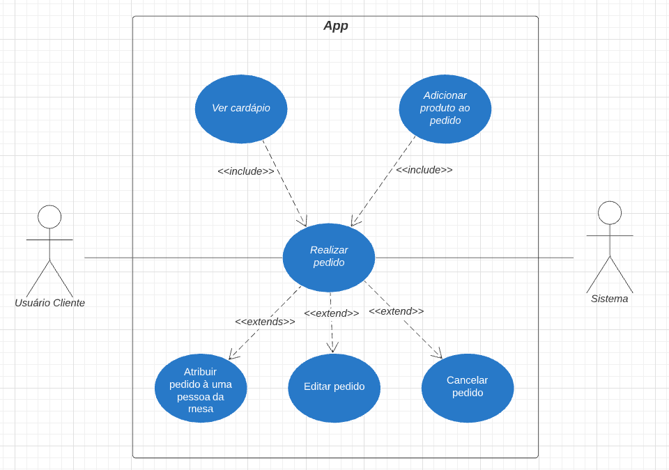
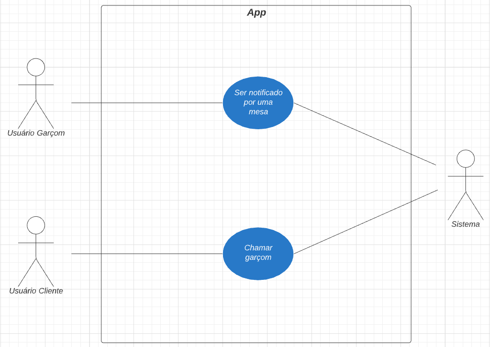
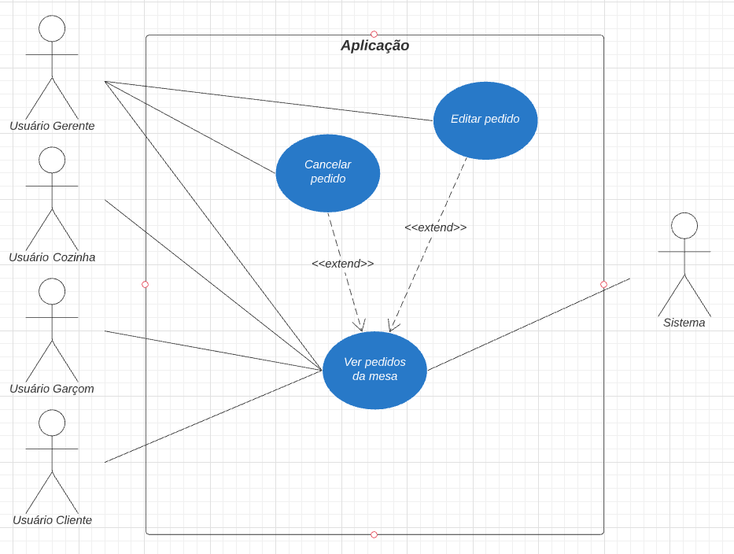
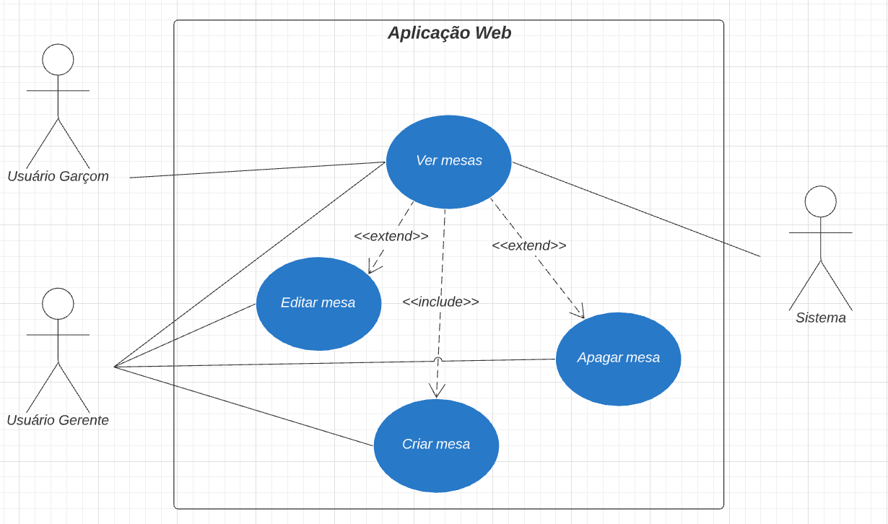
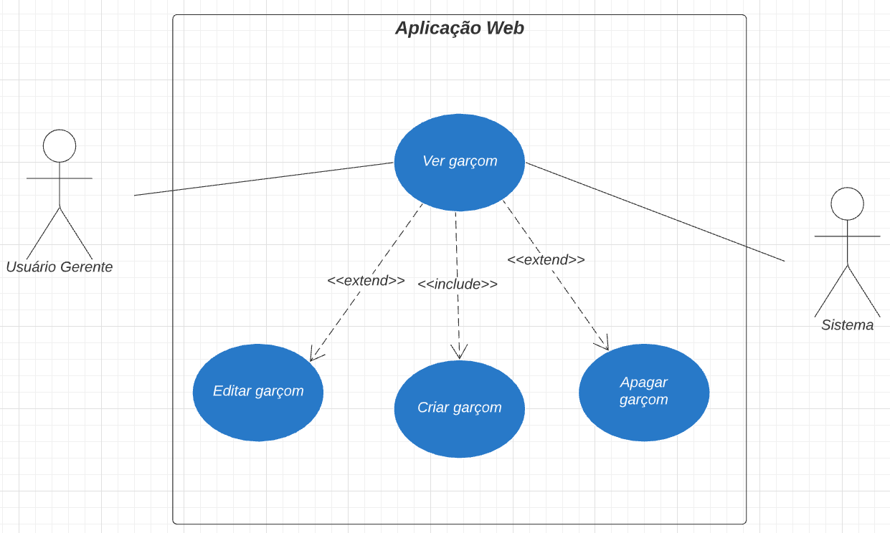
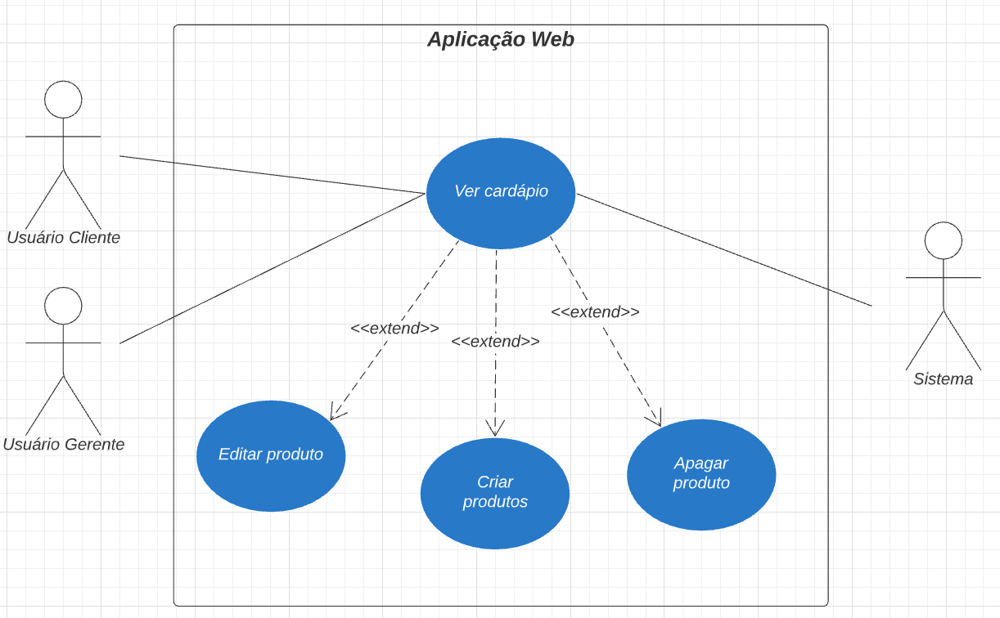
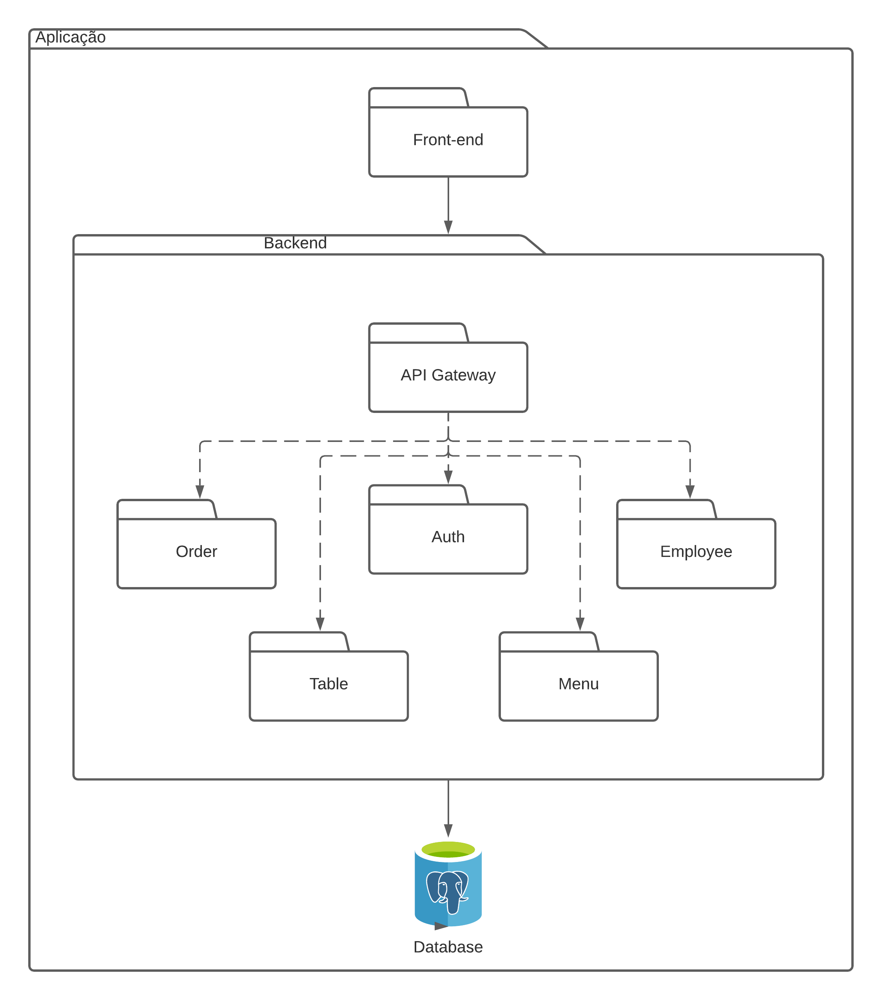
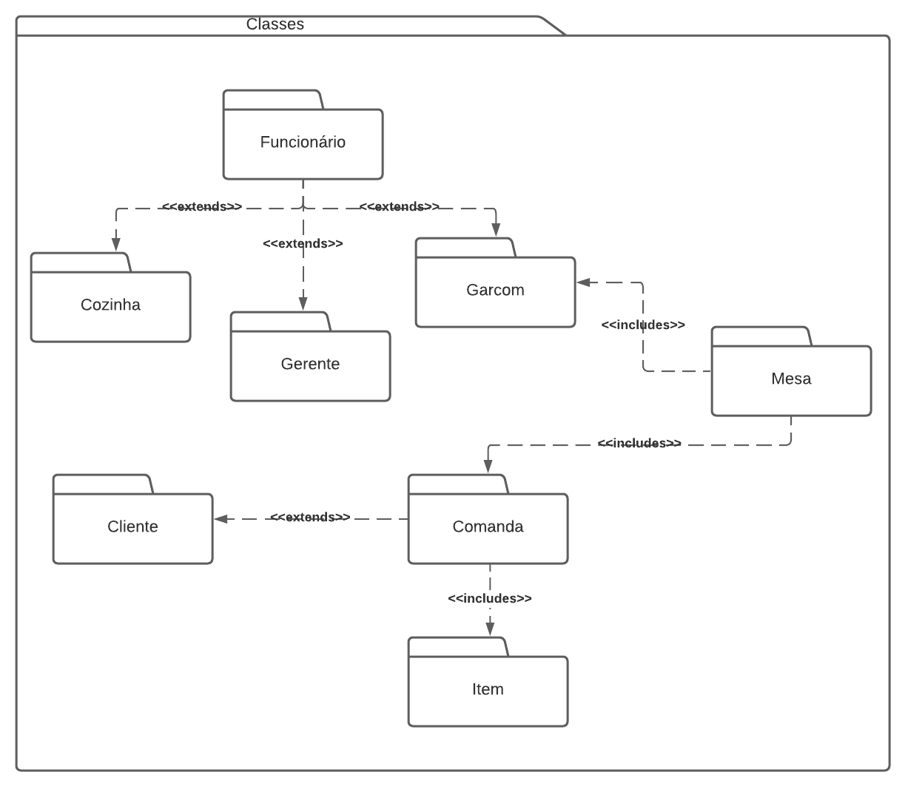
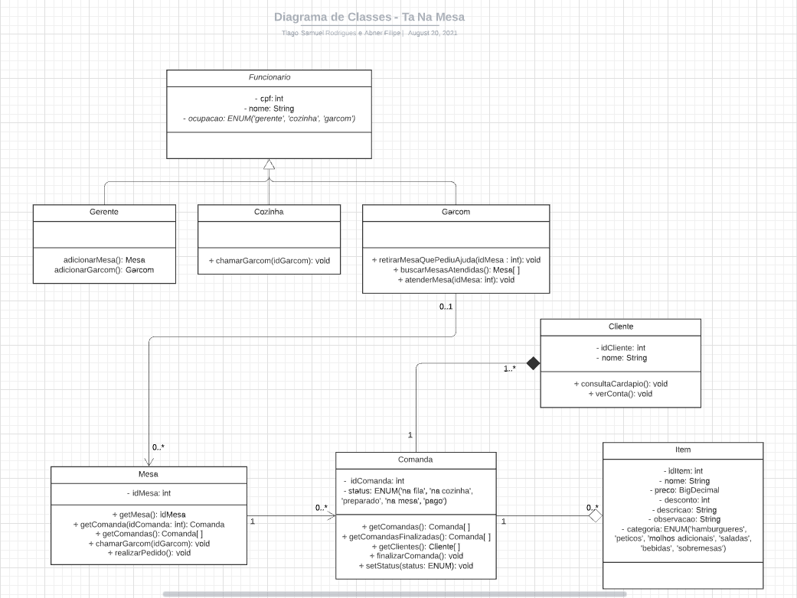

# Documento de Arquitetura de Software

## 1 Introdução

### 1.1 Finalidade

A intenção desse documento de arquitetura é mostrar e documentar informações e decisões relevantes do projeto Tá na Mesa do ponto de vista arquitetural. Facilitando a visualização e entendimento da estrutura do projeto.

### 1.2 Escopo

Este Documento de Arquitetura de Software se aplica ao Projeto Tá Na Mesa. Desenvolvido na disciplina de Arquitetura e Desenho de Software da Universidade de Brasília.

Uma prática comum em projetos desenvolvidos com o auxílio do _RUP (Rational Unified Procces)_é utilizar o DAS (Documento de Arquitetura de Sofwtare), divididido em módulos que são chamado de modelo de visualização 4+1.

<figcaption>Figura 01. Imagem que contém representação do modelo de visualização 4+1.</figcaption>

Por conseguinte do que se mostra na imagem acima, as visões presentes neste modelo são:

- Visão de Casos de Uso.
- Visão Lógica.
- Visão de Implementação.
- Visão de Processo.
- Visão de Imaplantação.
- Visão de Dados, que é opcional.
### 1.3 Definições, Acrônimos e Abreviações

- UnB - Universidade de Brasília
- Tá na Mesa - Sistema web e mobile focado em restaurantes e lanchonetes com o objetivo de melhorar a qualidade do atendimento e experiência no local
- Backend - Parte do sistema responsável por prover e organizar recursos para a interfáce do sistema
- Frontend - Parte do sistema responsável por ser a interfáce entre o sistema e o usuário
- DAS - Documento de Arquitetura de Software

## 2 Representação da Arquitetura

### 2.1 Tecnologias

### 2.1.1 Frontend

#### ReactJS

ReactJS é uma biblioteca de código aberto com foco em criar interfaces de usuário em páginas Web. Este framework é mantido pelo Facebook, Instagram e outras empresas além de um comunidade de desenvolvedores. 

### PWA

PWA (Progressive Web App) é uma aplicação híbrida entre web e mobile onde é possível fazer o download de um site para que ele vire uma aplicação no celular.

### 2.1.2 Backend
#### 

Node.js é um software de código aberto, multiplataforma, baseado no interpretador V8 do Google e que permite execução de códigos JavScript fora do navegador. Este software foi criado utilizando a linguagem JavaScript.

### 2.1.3 Banco de Dados
#### PostgreSQL

PostgreSQL é um SGBD(Sistema Gerenciador de Banco de Dados) relacional, desenvolvido como um projeto de código aberto, que já conta com mais de 30 anos de desenvolvimento ativo. É um sistema muito conhecido por sua forte reputação de confiabilidade e recursos de desempenho.

## 3 Requisitos e Restrições Arquiteturais

### 3.1 Requisitos

|Requisitos||
|:-----|:------|
|Escalabilidade|A aplicação deve ser escalável|
|Deploy|A aplicação deve possuir deploy automatizado|
|Segurança|A aplicação deve possuir mecanismos de proteção dos dados mais sensíveis dos usuários|

### 3.2 Restrições

|Restrições||
|:-----|:------|
|Plataforma|A aplicação terá suporte para browsers no computador, tablet e celular|
|Público|A aplicação será desenvolvida voltada ao público brasileiro e que possui empreendimentos no ramo alimentício|
|Linguagem|A aplicação será desenvolvida em português do Brasil|
|Prazo|O escopo proposto deve ser terminado até o final da disciplina|
|Equipe|A equipe possui apenas 10 integrantes|
|Conectividade|É necessária a conexão com internet para utilização da aplicação|       
                                                                                                                                                                                                                                           
## 4 Visão de Casos de Uso

A _Visão de Casos de Uso_ busca demonstrar um modelo de alto nível em relação as funcionalidades do sistema. Neste caso será feito através dos **Diagramas de Caso de Uso**.

<figcaption>Figura 03. Imagem que contém o diagrama do caso de uso UC01.</figcaption>

|   UC01   |  Informações  |
| ----------------- | ------- |
| Descrição | O cliente realiza um pedido |
| Ator | Cliente |
| Pré-condições | Acesso a Internet e estar numa mesa |
| Ação | O usuário vê produtos e os adiciona na conta |
| Fluxo Principal | **FP01:** Fluxo de adicionar produtos pela primeira vez   1. O ator entra no aplicativo   2. O sistema exibe uma lista de produtos   3. O ator procura pelo produto que deseja   4. O ator clica sobre a imagem desse produto   5. O ator visualiza detalhes e o adiciona ou volta para o passo 3   6. O ator confirma o pedido. |
| Fluxo Alternativo | **FA01:** Fluxo quando já há produtos    1. O ator entra no aplicativo   2. O ator clica no botão flutuante de pedidos   3. O sistema exibe a lista de produtos selecionados   4. O ator adiciona/retira os produtos existentes   5. O ator confirma o pedido. |
| Pós-condições | O ator irá esperar pelo pedido ficar pronto |
| Rastreabilidade | Requisitos Funcionais 1, 2, 13, 14, 22, 26, 27, 30, 41, 44, 56-61, 63  do [documento de Priorização](https://unbarqdsw2021-1.github.io/2021.1_G02_TaNaMesa_docs/1-Base/Projeto-Nao-Orientado-Abordagens-Especificas/Priorizacao-MOSCOW/) |

### 2.2. UC02 - Chamar o garçom

<figcaption>Figura 04. Imagem que contém o diagrama do caso de uso UC02.</figcaption>

|   UC01   |  Informações  |
| ----------------- | ------- |
| Descrição | O cliente chama o garçom |
| Ator | Cliente, Garçom |
| Pré-condições | Acesso a Internet e estar numa mesa |
| Ação | O cliente envia um chamado para o garçom |
| Fluxo Principal | **FP01:** Fluxo de enviar mensagem para um usuário que o ator já interagiu   1. O cliente entra no aplicativo   2. O cliente clica no botão de chamar o garçom   3. O garçom recebe o chamado no seu celular   4. O garçom comparece a mesa chamada. |
| Fluxo Alternativo | |
| Pós-condições | O cliente foi atendido pelo garçom |
| Rastreabilidade | Requisitos Funcionais 12, 21, 23 do [documento de Priorização](https://unbarqdsw2021-1.github.io/2021.1_G02_TaNaMesa_docs/1-Base/Projeto-Nao-Orientado-Abordagens-Especificas/Priorizacao-MOSCOW/) |

### 2.3. UC03 - Ver pedidos

<figcaption>Figura 05. Imagem que contém o diagrama do caso de uso UC03.</figcaption>

|   UC01   |  Informações  |
| ----------------- | ------- |
| Descrição | O ator vê os pedidos de uma mesa |
| Ator | Gerente, Cozinha, Garçom, Cliente |
| Pré-condições | Acesso a Internet e possuir o aplicativo |
| Ação | O ator visualiza os produtos adicionados pela mesa |
| Fluxo Principal | **FP01:** Fluxo da Cozinha, Garçom e Cliente   1. O ator entra no aplicativo   2. O ator seleciona a opção de ver pedidos   3. O sistema exibe a lista de produtos pedidos  |
| Fluxo Alternativo | **FA01:** Fluxo do Gerente   1. O gerente entra no aplicativo   2. O gerente seleciona a opção de ver pedidos   3. O sistema exibe a lista de produtos pedidos  4. O gerente mantém, edita ou cancela um pedido conforme a necessidade. |
| Pós-condições | O ator visualizou os pedidos realizados |
| Rastreabilidade | Requisitos Funcionais 3-7, 9, 13, 15-19, 24, 28-29, 33-36, 42, 45-50, 54 do [documento de Priorização](https://unbarqdsw2021-1.github.io/2021.1_G02_TaNaMesa_docs/1-Base/Projeto-Nao-Orientado-Abordagens-Especificas/Priorizacao-MOSCOW/) |

### 2.4. UC04 - Ver mesas

<figcaption>Figura 06. Imagem que contém o diagrama do caso de uso UC04.</figcaption>

|   UC01   |  Informações  |
| ----------------- | ------- |
| Descrição | O ator vê ou gerencia uma mesa |
| Ator | Gerente, Garçom |
| Pré-condições | Acesso a Internet e possuir o aplicativo |
| Ação | O ator visualiza uma mesa ou a gerencia |
| Fluxo Principal | **FP01:** Fluxo do Garçom   1. O garçom entra no aplicativo   2. O garçom seleciona a opção de ver mesas   3. O sistema exibe a lista de mesas  |
| Fluxo Alternativo | **FA01:** Fluxo do Gerente   1. O gerente entra no aplicativo   2. O gerente seleciona a opção de ver mesas   3. O sistema exibe a lista de mesas  4. O gerente adiciona, edita ou apaga uma mesa conforme a necessidade. |
| Pós-condições | O ator visualizou ou gerenciou as mesas |
| Rastreabilidade | Requisitos Funcionais 10, 31-32, 51-53 do [documento de Priorização](https://unbarqdsw2021-1.github.io/2021.1_G02_TaNaMesa_docs/1-Base/Projeto-Nao-Orientado-Abordagens-Especificas/Priorizacao-MOSCOW/) |

### 2.5. UC05 - Gerenciar garçons

<figcaption>Figura 07. Imagem que contém o diagrama do caso de uso UC05.</figcaption>

|   UC01   |  Informações  |
| ----------------- | ------- |
| Descrição | O gerente vê ou gerencia um garçom |
| Ator | Gerente |
| Pré-condições | Acesso a Internet e possuir o aplicativo |
| Ação | O gerente visualiza um garçom ou o gerencia |
| Fluxo Principal | **FP01:** Fluxo para visualizar garçons   1. O gerente entra no aplicativo   2. O gerente seleciona a opção de ver garçom   3. O sistema exibe a lista de garçons  |
| Fluxo Alternativo | **FA01:** Fluxo para gerenciar garçons   1. O gerente entra no aplicativo   2. O gerente seleciona a opção de ver garçom   3. O sistema exibe a lista de garçons  4. O gerente adiciona, edita ou apaga um garçom conforme a necessidade. |
| Pós-condições | O gerente gerenciou ou visualizou um garçom |
| Rastreabilidade | Requisitos Funcionais 20, 39-40  do [documento de Priorização](https://unbarqdsw2021-1.github.io/2021.1_G02_TaNaMesa_docs/1-Base/Projeto-Nao-Orientado-Abordagens-Especificas/Priorizacao-MOSCOW/) |

### 2.6. UC06 - Gerenciar cardápio

<figcaption>Figura 08. Imagem que contém o diagrama do caso de uso UC06.</figcaption>

|   UC01   |  Informações  |
| ----------------- | ------- |
| Descrição | O ator vê ou gerencia um cardápio |
| Ator | Cliente, Gerente |
| Pré-condições | Acesso a Internet e possuir o aplicativo |
| Ação | O ator visualiza um cardápio ou o gerencia |
| Fluxo Principal | **FP01:** Fluxo para visualizar cardápio   1. O ator entra no aplicativo   2. O ator seleciona a opção de ver cardápio   3. O sistema exibe a lista de produtos no cardápio.  |
| Fluxo Alternativo | **FA01:** Fluxo para gerenciar cardápio   1. O gerente entra no aplicativo   2. O gerente seleciona a opção de ver cardápio   3. O sistema exibe a lista de produtos no cardápio  4. O gerente adiciona, edita ou apaga um produto do cardápio conforme a necessidade. |
| Pós-condições | O ator gerenciou ou visualizou o cardápio |
| Rastreabilidade | Requisitos Funcionais 1, 11, 37-38, 55, 57, 62-63 do [documento de Priorização](https://unbarqdsw2021-1.github.io/2021.1_G02_TaNaMesa_docs/1-Base/Projeto-Nao-Orientado-Abordagens-Especificas/Priorizacao-MOSCOW/) |

## 3 Visão Lógica

A _Visão Lógica_ busca demonstrar a organização conceitual da aplicação em termos de **camadas**, **pacotes**, **classes** e **interfaces**.

### 3.1 Diagrama de Contexto

Este diagrama é focado em demonstrar o escopo da aplicação através do fluxo de dados de maior nível, ou seja, representando todo o sistema. Este diagrama foi desenvolvido no início do projeto e de acordo com as necessidades foi sendo alterado e pode ser vista em *[Descrição Arquitetural](https://unbarqdsw2021-1.github.io/2021.1_G02_TaNaMesa_docs/2-Modelagem/extras/arquitetura/)*. Abaixo segue a versão mais atualizada:

<figcaption>Figura 09. Resultado do diagrama de contexto.</figcaption>

### 3.2 Diagramas de Pacotes

<figcaption>Figura 09. Imagem que contém o diagrama de pacotes da aplicação.</figcaption>

| DP01       | Diagrama de Pacotes da Aplicação  |
| :--------- | :------------------  |
| **Versão**    | Atual: 1.0 (21/08) Anterior: - |
| **Descrição** | Diagrama UML de pacotes da aplicação |
| **Autor(es)**     | [Daniel Primo](https://github.com/danieldagerom) e [Tiago Samuel](https://github.com/tsrrodrigues) |
 

 ## 4 Visão de Implementação

A _Visão de Implementação_ mostra como, de fato, a aplicação será desenvolvida.
### 4.1 Diagrama de Pacotes de Classes

<figcaption>Figura 10. Imagem que contém o diagrama de pacotes de classes.</figcaption>

| DP02       | Diagrama de Pacotes de Classes  |
| :--------- | :------------------  |
| **Versão**    | Atual: 1.0 (21/08) Anterior: - |
| **Descrição** | Diagrama UML de pacotes de classes |
| **Autor(es)**     | [Daniel Primo](https://github.com/danieldagerom) e [Tiago Samuel](https://github.com/tsrrodrigues) |

### 4.2 Diagrama de classes

### 4.2.1 Descrição
Diagramas de classes mapeiam de forma clara a estrutura de um determinado sistema ao modelar suas classes, seus atributos, operações e relações entre objetos. A forma de classe em si consiste em um retângulo com três linhas. A linha superior contém o nome da classe, a linha do meio, os atributos da classe e a linha inferior expressa os métodos ou operações que a classe pode utilizar. Classes e subclasses são agrupadas juntas para mostrar a relação estática entre cada objeto.

Para o diagrama de classes do nosso projeto, escolhemos realizar um único diagrama geral. Foi escolhido dessa maneira, pois temos apenas um banco de dados, o que nos fez escolher apenas um diagrama de classes para representar a aplicação como um todo.
Nos baseamos, além do material disponibilizado na disciplina, na [Modelagem de Dados](https://unbarqdsw2021-1.github.io/2021.1_G02_TaNaMesa_docs/2-Modelagem/extras/Modelo-Dados/) do **Tá Na Mesa** e em um projeto antigo da disciplina chamado [QR Comer](https://fga-desenho-2019-2.github.io/Wiki/seminario3/diagramas_estaticos/#4-diagrama-de-classes-e-microservicos), que possui um sistema semelhante ao nosso, o que nos deu uma visão de métodos e atributos que não foram pensados em um primeiro momento pela equipe.

<figcaption>Figura 11. Imagem que contém o diagrama de classes da aplicação.</figcaption>

| DC01       | Diagrama de Classes  |
| :--------- | :------------------  |
| **Versão**    | Atual: 1.0 (20/08) Anterior: - |
| **Descrição** | Diagrama UML de classes da aplicação |
| **Autor**     | [Abner Filipe](https://github.com/abner423) e [Tiago Samuel](https://github.com/tsrrodrigues) |

## 5 Visão de Processo

### 5.1 Realizar Pedido

<figcaption>Figura 12. Resultado do diagrama de sequência da aplicação.</figcaption>

| **DS01**      | **Diagrama de Sequência - Realizar Pedido**                                                          |
| ------------- | ---------------------------------------------------------------------------------------------------- |
| **Descrição** | Fluxo de realização do pedido, com os atores Cliente, Garçom e Cozinha                               |
| **Autor**     | [Daniel Primo](https://github.com/danieldagerom) e [Herick Portugues](https://github.com/herickport) |

## 6 Visão de Dados

### 6.1 Diagrama Lógico de Dados (DLD)

<figcaption>Figura 13. Resultado do diagrama lógico de dados.</figcaption>

### 6.2 Dicionário de Dados

Entidade: **FUNCIONARIO**

| Atributo | Propriedade do aributo | Tipo de Dado | Tamanho | Descrição |
| :-: | :-: | :-: | :-: | :-: |
| cpf | Chave Primária | bigint | 11 | Identificador de cada funcionário |
| nome | Obrigatório | varchar | 50 | Nome completo de cada funcionário |
| ocupacao | Obrigatório | enum('gerente','cozinha', 'garcom') | 10 | Representa a atuação do funcionário dentro do restaurante |

Entidade: **CLIENTE**

| Atributo | Propriedade do aributo | Tipo de Dado | Tamanho | Descrição |
| :-: | :-: | :-: | :-: | :-: |
| idCliente | Chave Primária | int | - | Chave identificadora do cliente, é gerada automaticamente pelo banco |
| nome | Chave Primária | varchar | 50 | Nome fornecido pelo cliente para constar na comanda individual |
| idComanda | Chave Estrangeira | int | - | Chave identificadora de cada comanda individual realizado por uma mesa |

Entidade: **COMANDA**

| Atributo | Propriedade do aributo | Tipo de Dado | Tamanho | Descrição |
| :-: | :-: | :-: | :-: | :-: |
| idComanda | Chave Primária | int | - | Chave identificadora de cada comanda individual realizado por uma mesa |
| status | Obrigatório | enum('na fila','na cozinha','preparado','na mesa')| 10 | Situação do comanda após ser efetuado pelo cliente |
| idMesa | Chave Estrangeira | int | - | Chave identificadora de cada mesa disbonivel para uso dos clientes |

Entidade: **ITEM**

| Atributo | Propriedade do aributo | Tipo de Dado | Tamanho | Descrição |
| :-: | :-: | :-: | :-: | :-: |
| idItem | Chave Primária | int | - | Chave identificadora de cada item disponível para comandas no cardápio|
| nome | Obrigatório | varchar | 50 | Nome do item fornecido pelo gerente no momento do cadastro |
| preco | Obrigatório | float | (4,2) | Preço individual do item sem incluir qualquer desconto |
| desconto | Opcional | int | 2 | Desconto que pode ser aplicado ao item em caso de promoção (sempre em porcentagem) |
| descricao | Obrigatório | varchar | 100 | Descrição do item contendo todos os ingredientes presentes em sua composição |
| observacao | Opcional | varchar | 100 | Observação manual que pode ser feita pelos clientes caso queiram retirar algum ingrediente do item |
| categoria | Obrigatório | enum('hamburgueres','petiscos', 'molhos adicionais', 'saladas','bebidas','sobremesas')| 20 | Grupo no qual os itens disponíveis são divididos |
| cpfGerente | Chave Estrangeira | bigint | 11 | Chave identificadora do gerente do estabelecimento, responsável pela criação e edição dos itens |

Entidade: **MESA**

| Atributo | Propriedade do aributo | Tipo de Dado | Tamanho | Descrição |
| :-: | :-: | :-: | :-: | :-: |
| idMesa | Chave Primária | int | - | Chave identificadora de cada mesa disbonivel para uso dos clientes |
| cpfGarcom | Chave Estrangeira | bigint | 11 | Chave identificadora do garçom responsável pelo atendimento da mesa |

    
## 8 Referências

> - PANT, Prabhu. A complete guide to PostgreSQL. [S. l.], 2018. Disponível [aqui](<https://medium.com/@heyPrabhu/a-complete-guide-to-postgresql-e4d1cefb9866>). Acesso em: 13 Outubro 2021.

> - WAYNER, Peter. The top 5 software architecture patterns: how to make the right choice. [S. l.]. Disponível [aqui](<ttps://techbeacon.com/app-dev-testing/top-5-software-architecture-patterns-how-make-right-choice>). Acesso em: 12 Outubro 2021.

> - Documento de arquitetura de software. Disponível [aqui](<https://www.cin.ufpe.br/~gta/rup-vc/extend.formal_resources/guidances/examples/resources/sadoc_v1.htm>) Acesso em: 11 de Outubro 2021.

> - Documento de arquitetura de software. Disponível [aqui](<https://www.cin.ufpe.br/~gta/rup-vc/core.informal_resources/guidances/examples/resources/ex_sad.htm>) Acesso em: 10 de Outubro 2021.

> - QRComer. Disponível [aqui](https://fga-desenho-2019-2.github.io/Wiki/seminario5/arquitetura/). Acesso em: 09 de Outubro 2021.

## Histórico de Revisões

| Data       | Versão | Descrição                                              | Autor(es)                                            |
| :--------- | :----- | :----------------------------------------------------- | :--------------------------------------------------- |
| 13/10/2021 | 0.1    | Adiciona estrutura do documento                        | [Tiago Rodrigues](https://github.com/tsrrodrigues) |
| 14/10/2021 | 0.2    | Cria o documento                                       | [Lucas Boaventura](https://github.com/lboaventura25) |
| 15/10/2021 | 0.3    | Adiciona imagens                                       | [Daniel Primo](https://github.com/danieldagerom) |
| 15/10/2021 | 0.4    | Atualiza diagrama de contexto | [Emily Dias](https://github.com/emysdias), [Hérick Portugues](https://github.com/herickport) |
| 15/10/2021 | 0.5    | Atualiza tópico de visão de dados | [Abner Filipe](https://github.com/abner423), [Sergio Cipriano](https://github.com/herickport), [Hérick Portugues](https://github.com/sergiosacj) |
| 15/10/2021 | 0.5    | Atualiza diagrama de  | [Eduarda Servidio](https://github.com/ServidioEC), [Brenda Santos](https://github.com/herickport), [ítalo Alves](https://github.com/alvesitalo) |

