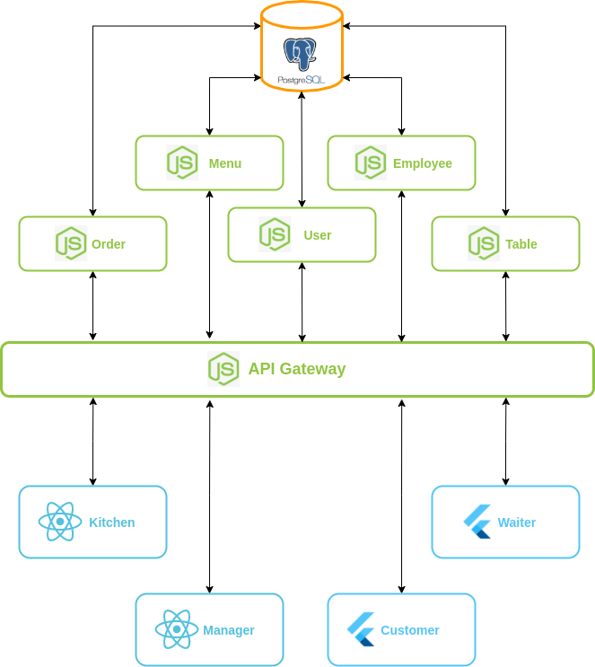

# Descrição Arquitetural

## 1. Introdução

Este documento tem como objetivo fazer uma descrição inicial do Documento de Arquitetura que será desenvolvido ao longo da disciplina.

### 1.1 Finalidade

O objetivo central desse documento é especificar algumas decisões tomadas pelo grupo através de reuniões pelo Discord. Ao longo do documento será descrito alguns pontos arquiteturais que foram levados em consideração neste momento inicial do projeto, além de buscar facilitar a visualização do resultado da estrutura da aplicação **Tá Na Mesa**.

### 1.2 Escopo

Este documento se aplica ao processo de desenvolvimento do **Tá Na Mesa**, aplicação desenvolvida na disciplina Arquitetura e Desenho de Software, na Universidade de Brasília.

## 2. Representação Arquitetural

Modelo de representação dos serviços implementados e as interações estabelecidas entre esses serviços, bem como a natureza dessas interações.

### 2.1 Tecnologias

#### 2.1.1 Front-End 

- **ReactJS**

ReactJS é uma biblioteca de código aberto com foco em criar interfaces de usuário em páginas Web. Este framework é mantido pelo Facebook, Instagram e outras empresas além de um comunidade de desenvolvedores. Esta biblioteca foi criada utilizando a linguagem JavaScript. Possui uma metodologia de desenvolvimento de software conhecida como PWA (Progressive Web App), que pode ser visto como uma evolução híbrida entre as páginas web e um aplicativo móvel.

#### 2.1.2 Back-End 

- **Node.js**

Node.js é um software de código aberto, multiplataforma, baseado no interpretador V8 do Google e que permite execução de códigos JavScript fora do navegador. Este software foi criado utilizando a linguagem JavScript.

#### 2.1.3 Banco de dados

- **PostgreSQL**

PostgreSQL é um SGBD(Sistema Gerenciador de Banco de Dados) relacional, desenvolvido como um projeto de código aberto, que já conta com mais de 30 anos de desenvolvimento ativo. É um sistema muito conhecido por sua forte reputação de confiabilidade e recursos de desempenho.

### 2.2 Motivação Arquitetural

As tecnologias disponíveis no mercado foram analisadas e basicamente todas realizam as operações necessárias para a nossa aplicação, por fim foi levado em consideração a opinião pessoal de cada membro e suas respectivas familiaridades com as tecnologias avaliadas.

### 2.3 Abordagem arquitetural

- **Microsserviços**

A arquitetura de microsserviços é uma abordagem que separa uma aplicação única em pequenos blocos independentes. Estes blocos são chamados de serviços que executam suas próprias regras de negócio e se comunicam, quase sempre, por meio de métodos HTTP. A divisão dos serviços no projeto **Tá Na Mesa** foi feita levando em conta a abordagem de sub-domínios, técnica que leva em conta o ponto de vista de negócio para estabelecer a distribução de responsabilidades entre os serviços.

No software descrito nessa Wiki possui os seguintes módulos:

- **Order**, responsável por toda interação com os pedidos dos clientes.
- **Menu**, responsável por toda criação de produtos e separação por categorias.
- **Auth**, responsável por todo sistema de autenticação dos usuários no sistema.
- **Employee**, responsável por toda interação dos garçons no sistema, como serem chamados por alguma mesa.
- **Table**, responsável por toda interação com as mesas do estabelecimento.
- **Gateway**, responsável por intermediar a comunicação entre o Front-End e o Back-End.
---

- **PWA (App Shell)**

O PWA (Progressive Web App), que será usado no Front-end da aplicação possui uma arquitetura seguindo o modelo de App Shell (Casca de aplicativo). Este formato diminui as solicitações de atualização da página, porque separa as partes do aplicativo que são constantes a maior parte do tempo, como o menu, header, footer e outras partes do layout da página, essas partes constantes em conjunto são chamadas de App Shell. Fazendo isso gera uma fluidez de um aplicativo móvel, rodando um código Web.

### 2.4 Diagrama de Contexto

<figcaption>Figura 1. Resultado do diagrama de contexto.</figcaption>

|     Tema da Reunião      |       Participantes                                                                     |
| :------------ | :------------------------------------------------------------------------ |
| Definição do diagrama de contexto e tecnologias da aplicação |                      **Todos** os membros do grupo estavam presentes.                      |

## 3. Restrições e Metas Arquiteturais

### 3.1 Metas

|     Metas      |                                                                            |
| :------------: | :------------------------------------------------------------------------: |
| Escalabilidade |                       A aplicação deve ser escalável                       |
|   Segurança    | A aplicação deve tratar de forma segura os dados sensíveis dos usuários |
|     Deploy     |                A aplicação deve possuir deploy automatizado                |

### 3.2 Restrições

|  Restrições   |                                                                |
| :-----------: | :------------------------------------------------------------: |
| Conectividade |   É necessária a conexão com internet para utilização do App   |
|  Plataforma   |         A aplicação terá suporte somente para Android          |
|    Público    |  A aplicação será desenvolvida voltada ao público brasileiro   |
|   Linguagem   |      A aplicação será desenvolvida em português do Brasil      |
|    Equipe     |             A equipe possui apenas 10 integrantes              |
|     Prazo     | O escopo proposto pode ser alterado ao longo da disciplina     |

## 4. Referências

> - DONG, Tao. **Flutter**. [S. l.], 2019. Disponível em: https://medium.com/flutter. Acesso em: 16 de agosto de 2021.

> - **NODE.JS**. In: WIKIPÉDIA, a enciclopédia livre. Flórida: Wikimedia Foundation, 2019. Disponível em: https://pt.wikipedia.org/w/index.php?title=Node.js&oldid=55592828. Acesso em: 16 de agosto de 2021.

> - MALLAWAARACHCHI, Vijini. 10 Common Software Architectural Patterns in a nutshell. [S. l.], 2017. Disponível em: https://towardsdatascience.com/10-common-software-architectural-patterns-in-a-nutshell-a0b47a1e9013. Acesso em: 16 de agosto de 2021.

> - PANT, Prabhu. **A complete guide to PostgreSQL**. [S. l.], 2018. Disponível em: https://medium.com/@heyPrabhu/a-complete-guide-to-postgresql-e4d1cefb9866. Acesso em: 16 de agosto de 2021.

> - RICHARDSON, Chris. **Pattern**: Decompose by subdomain. [S. l.]. Disponível em: https://microservices.io/patterns/decomposition/decompose-by-subdomain.html. Acesso em: 16 de agosto de 2021.

> - RICHARDSON, Chris. **What are microservices?**. [S. l.]. Disponível em: https://microservices.io/index.html. Acesso em: 16 de agosto de 2021.

> - WAYNER, Peter. **The top 5 software architecture patterns**: how to make the right choice. [S. l.]. Disponível em: https://techbeacon.com/app-dev-testing/top-5-software-architecture-patterns-how-make-right-choice. 16 de agosto de 2021.

> - GoodBarber Team. **PWAs - Fundamentos da tecnologia e estudos de casos poderosos**: how to make the right choice. [S. l.]. Disponível em: https://pt.goodbarber.com/blog/pwas-fundamentos-da-tecnologia-e-estudos-de-casos-poderosos-a783/. 17 de agosto de 2021.

## Histórico de Revisões

| Data       | Versão | Descrição                                    | Autor(es)                                                                                                |
| :--------- | :----- | :------------------------------------------- | :------------------------------------------------------------------------------------------------------- |
| 16/08/2021 | 0.1    | Adiciona estrutura do documento              | [Lucas Boaventura](https://github.com/lboaventura25)                                                     |
| 16/08/2021 | 1.0    | Cria o documento                             | [Lucas Boaventura](https://github.com/lboaventura25)                                                     |
| 17/08/2021 | 1.1    | Adiciona correção de formatação no documento | [Lucas Boaventura](https://github.com/lboaventura25)                                                     |
| 17/08/2021 | 1.2    | Atualiza arquitetura após redefinição em grupo      | [Lucas Boaventura](https://github.com/lboaventura25)                                                     |
| 18/08/2021 | 1.3    | Correção de alguns erros de português      | [Eduarda Servidio](https://github.com/ServideoEC)                                                    |

