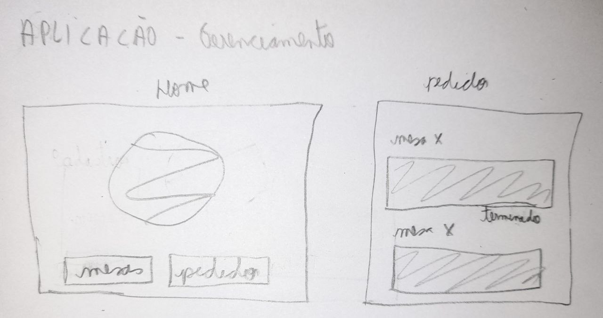

# Protótipo de baixa fidelidade

## 1. Introdução

&emsp;&emsp;O protótipo de baixa fidelidade é a melhor alternativa para um início de projeto, onde pode ser identificado problemas de usabilidade, pode-se testar conceitos da aplicação e descobrir o valor que o produto final pode gerar aos seus clientes.

&emsp;&emsp;O protótipo de baixa fidelidade é barato e rápido de fazer, além de servir como base para a criação de novos protótipos, com níveis maiores de fidelidade, durante o desenvolvimento do produto.

## 2. Protótipo

### 2.1. Aplicação Cliente

- Home e Cardápio
  

- Após selecionar cardápio, Detalhes dos pedidos e Extrato
  

### 2.2. App Garçom

- Home e Detalhes
  

### 2.3. Aplicação Cozinha

- Home e Detalhes
  

### 2.4. Aplicação Gerenciamento

- Home e Pedidos
  

- Mesas, Cardápio e Cadastro mesas
  

## 3. Resultado

| Número | Requisito                                                          |
| :----- | :----------------------------------------------------------------- |
| 1      | O cliente ser capaz de ver o cardápio                              |
| 2      | O cliente ser capaz de escolher as opções do cardápio              |
| 3      | O cliente ser capaz de chamar o garçom                             |
| 4      | O cliente conseguir dividir a conta com mais de uma pessoa         |
| 5      | O cliente conseguir ver o extrato do pedido                        |
| 6      | O cliente conseguir ver detalhes do seu pedido                     |
| 7      | O cliente conseguir enviar pedido                                  |
| 8      | O cliente ser capaz de transitar entre as telas                    |
| 9      | O cliente ser capaz de fazer outro pedido                          |
| 10     | O garçom receber notificação de qual mesa está chamando ele        |
| 11     | O garçom ser capaz de ver quais mesas os pedidos foram preparados  |
| 12     | O garçom ser capaz de avisar qual mesa o pedido já foi entregue    |
| 13     | O garçom ser capaz de ver detalhes do pedido que as mesas pediram  |
| 14     | O cozinheiro ser capaz de ver os pedidos ativos das mesas          |
| 15     | O cozinheiro conseguir avisar que o pedido da mesa x foi terminado |
| 16     | O cozinheiro ver os pedidos que foram finalizados                  |
| 17     | O gerente ser capaz de ver detalhes das mesas                      |
| 18     | O gerente ser capaz de cadastrar mesas                             |
| 19     | O gerente ser capaz de editar detalhes das mesas                   |
| 20     | O gerente ser capaz de excluir detalhes das mesas                  |
| 21     | O gerente ser capaz de cadastrar itens do cardápio                 |
| 22     | O gerente ser capaz de editar itens do cardápio                    |
| 23     | O gerente ser capaz de excluir itens do cardápio                   |
| 24     | O gerente ser capaz de ver detalhes dos pedidos das mesas          |
| 25     | O gerente ser capaz de ver status dos pedidos das mesas            |

## 4. Referências

> - Protótipo de baixa fidelidade: o que é e como desenvolver em um projeto?. DigitalHouse, 27 abril. 2021. Disponível em: https://www.digitalhouse.com/br/blog/prototipo-de-baixa-fidelidade. Acesso em: 31 de Jul. 2021.

## Histórico de Revisões

| Data       | Versão | Descrição                                          | Autor(es)                                 |
| :--------- | :----- | :------------------------------------------------- | :---------------------------------------- |
| 31/07/2021 | 1.0    | Adição do documento e criação dos tópicos 1, 2 e 3 | [Emily Dias](https://github.com/emysdias) |
| 02/08/2021 | 1.1    | Adição do subtópico 2.4 e tópico 3                 | [Emily Dias](https://github.com/emysdias) |
