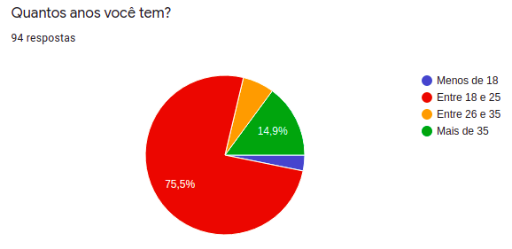
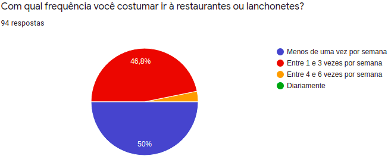
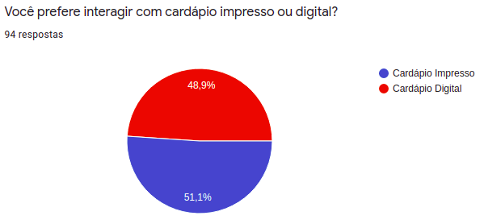

# Questionário

## 1. Introdução

Questionário é uma técnica de elicitação de requisitos. Através dele podemos fazer análises subjetivas, por meio de uma pesquisa com várias pessoas. Antes da criação desse documento foi confeccionado um questionário no [_Google Forms_](https://workspace.google.com/intl/pt-BR/products/forms/?utm_source=google&utm_medium=cpc&utm_campaign=latam-BR-all-pt-dr-bkws-all-all-trial-e-dr-1009897-LUAC0011908&utm_content=text-ad-none-any-DEV_c-CRE_477535133211-ADGP_Hybrid%20%7C%20BKWS%20-%20MIX%20%7C%20Txt%20~%20Forms-KWID_43700057676889044-kwd-10647024857&utm_term=KW_google%20forms-ST_google%20forms&gclid=CjwKCAjwr56IBhAvEiwA1fuqGktqD-lXkUkcdn9v7B8hbBukmFjcpGL4xDynT4RSzGsv2qPdKOBwEBoC_hUQAvD_BwE&gclsrc=aw.ds) a fim de elicitar os requisitos da aplicação **Tá Na Mesa**.

## 2. Metodologia

O questionário possui perguntas que tem por objetivo olhar do ponto de vista dos usuários em potencial da aplicação quais são os principais problemas encontrados ao visitar restaurantes, lanchonetes e semelhantes. Por conseguinte, podemos checar se os problemas apontados pelos usuários seriam resolvidos com a aplicação proposta pelo nosso grupo. O questionário foi divulgado em grupos da faculdade, de familiares e de pessoas conhecidas dos integrates do nosso grupo. Ao total, foram coletadas 94 respostas.

## 3. Perguntas

Abaixo estão as perguntas e suas respectivas respostas.
2021.1_G02_TaNaMesa_docs/docs/assets/img/questionario/pergunta-1.png

### Pergunta 1

<figcaption>Figura 1. Imagem que contém o gráfico de respostas da 1ª pergunta.</figcaption>

### Pergunta 2

<figcaption>Figura 2. Imagem que contém o gráfico de respostas da 2ª pergunta.</figcaption>

### Pergunta 3

<figcaption>Figura 3. Imagem que contém o gráfico de respostas da 3ª pergunta.</figcaption>

### Pergunta 4

<figcaption>Figura 4. Imagem que contém o gráfico de respostas da 4ª pergunta.</figcaption>

### Pergunta 5

<figcaption>Figura 5. Imagem que contém o gráfico de respostas da 5ª pergunta.</figcaption>

### Pergunta 6

<figcaption>Figura 6. Imagem que contém o gráfico de respostas da 6ª pergunta.</figcaption>

### Pergunta 7

<figcaption>Figura 7. Imagem que contém o gráfico de respostas da 7ª pergunta.</figcaption>

### Pergunta 8

<figcaption>Figura 8. Imagem que contém o gráfico de respostas da 8ª pergunta.</figcaption>

### Pergunta 9

<figcaption>Figura 9. Imagem que contém o gráfico de respostas da 9ª pergunta.</figcaption>

### Pergunta 10

<figcaption>Figura 10. Imagem que contém o gráfico de respostas da 10ª pergunta.</figcaption>

### Pergunta 11

<figcaption>Figura 11. Imagem que contém o gráfico de respostas da 11ª pergunta.</figcaption>

### Pergunta 12

<figcaption>Figura 12. Imagem que contém o gráfico de respostas da 12ª pergunta.</figcaption>

### Pergunta 13

<figcaption>Figura 13. Imagem que contém o gráfico de respostas da 13ª pergunta.</figcaption>

### Pergunta 14

<figcaption>Figura 14. Imagem que contém o gráfico de respostas da 14ª pergunta.</figcaption>

## 4. Análise

De acordo com os resultados levantados 46,8% das pessoas costumam frequentar restaurantes e lanchonetes de 1 a 3 vezes por semana. E desses cerca de 51% preferem o uso de cardápios impressos que de acordo com outras perguntas isso acontece porque os cardápios digitais não geram as mesmas expectativas que os impressos. É necessário que os cardápios digitais envolvam os usuários para se tornar mais interessante e completo que os já existentes.

Os principais problemas já encontrados pelas pessoas ao fazer o pedido são: dificuldade para chamar o garçom, demora do garçom e demora pra receber o cardápio. Ou seja, muitos problemas se resumem a falhas do garçom ou pouca disponibilidade de garçons nos resturantes. Cardápios pouco detalhados e com poucas imagens também fazem os clientes terem problemas, em alguns momentos disseram que os cardápios digitais possuem pouquissímas imagens, deram a ideia de ter alguns vídeos nos cardápios digitais. Cerca de 84% já vivenciaram alguma situação em que o garçom errou o pedido, o que traz a necessidade de um sistema imparcial que possa gravar os pedidos e ser obsservado pelos clientes para terem certeza de seus pedidos.

Em 91% das respostas, quando as pessoas saem com amigos costumam dividir a conta da mesa, 30% gostariam de dividir a conta com os familiares presentes e 30% dividem a conta com seus namorados. E quase 62% das pessoas tiveram problemas em dividir a conta com as pessoas que estavam em sua mesa. As principais dificuldades encontradas são: fazer os cálculos e para lembrar o que pediu, lembrar quanto valem os itens do cardápio, demora no pagamento e porque o resturante só dividia a conta em partes iguais.

Em uma escala de 1 a 5, onde 1 é discordo totalmente e 5 é concordo totalmente. Levando em consideração os que votaram 4 ou 5:

- Cerca de 65% gostariam de ver o cardápio em um tablet instalado nas mesas do estabelecimento.

- Cerca de 66% gostariam de fazer o pedido digitalmente.

- Cerca de 75% gostariam de poder chamar o garçom diretamente pelo tablet para tirar dúvidas ou fazer alguma observação.

- Cerca de 84% gostariam de dividir a conta de acordo com o que cada um pediu.

## 5. Requisitos

Após a utilização da técnica de questionário foi possível levantar os requisitos listados abaixo.

| Número | Requisito                                                                                                                                         |
| :----: | :------------------------------------------------------------------------------------------------------------------------------------------------ |
|   1    | O cliente deve poder visualizar um cardápio digital com imagens, boas descrições e também vídeos.                                                 |
|   2    | O cliente deve poder chamar o garçom através do aplicativo.                                                                                       |
|   3    | O garçom deve poder ver uma fila com as mesas que precisam de atendimento.                                                                        |
|   4    | O garçom deve poder ver a quanto tempo as mesas já estão esperando por atendimento.                                                               |
|   5    | O cliente deve poder fazer o pedido pelo aplicativo e visualizar o pedido para checagem antes de enviar para a cozinha.                           |
|   6    | O garçom deve poder visualizar os pedidos das mesas.                                                                                              |
|   7    | O cliente deve poder separar os pedidos por cada pessoa da mesa                                                                                   |
|   8    | O cliente deve poder visualizar a conta a ser paga por nome das pessoas que fizeram os pedidos, detalhado por item e valor presentes no cardápio. |
|   9    | O cliente deve poder visualizar a conta a ser paga por nome das pessoas que fizeram os pedidos.                                                   |

## 6. Referências

> - SERRANO, Maurício; SERRANO, Milene. Requisitos - Aula 07. 1º/2019. 50 slides. Material apresentado para a disciplina de Requisitos de Software no curso de Engenharia de Software da UnB, FGA.

> - VALQUEZ, Carlos Eduardo; SIMÕES, Guilherme Siqueira. Engenharia de Requisitos.

> - Questionário aplicado via Google Forms. Disponível em: [Respostas do questionário](https://docs.google.com/spreadsheets/d/1rFbt2wUSQeqWjOoy4sZR3ZsuhSiZscUb5fAKglYEIBA/edit?usp=sharing) . Acesso em: 02/08/2021.

## Histórico de Revisões

| Data       | Versão | Descrição                                    | Autor(es)                                                                                                |
| :--------- | :----- | :------------------------------------------- | :------------------------------------------------------------------------------------------------------- |
| 02/08/2021 | 1.0    | Adiciona estrutura do documento              | [Lucas Boaventura](https://github.com/lboaventura25) e [Hérick Portugues](https://github.com/herickport) |
| 02/08/2021 | 1.1    | Adiciona imagens e analise dos questionários | [Lucas Boaventura](https://github.com/lboaventura25) e [Hérick Portugues](https://github.com/herickport) |
| 03/08/2021 | 1.2    | Arrumando paths das imagens                  | [Emily Dias](https://github.com/emysdias), [Brenda Santos](https://github.com/brendavsantos)             |
