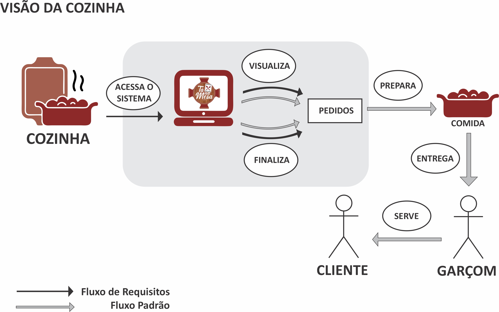
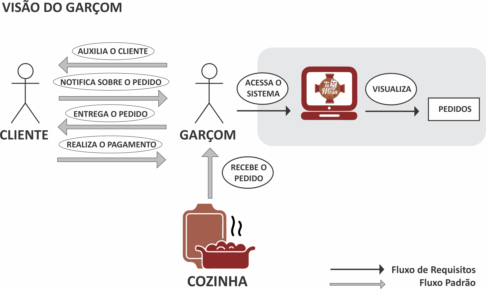

# Rich Pictures

## Introdução

&emsp;&emsp; O Rich Picture é uma forma de representar o sistema e suas interações por meio de diagramas gráficos.
É uma ferramenta que cabe muito bem em momentos iniciais ou de revisões do projeto fornecendo um modelo mental preliminar.

## Metodologia

&emsp;&emsp; A metodologia Soft Systems Methodology (SSM), que é agrupa nela os conceitos de rich picture, foi
proposta por Checkland (1999) apud Bernardo et al. (2008). Este método é utilizado para analisar problemas complexos
de uma perspectiva de sistema, onde se observa os problemas e suas soluções correspondentes. 

&emsp;&emsp; Para o rich picture foi feito a divisão que cada membro faria um modelo desenhado dos diagramas em algum
papel, com isto foi escolhido a rich picture com mais detalhes e mais correta, e por fim foi feito a evolução do sistema
para obter a versão final do rich picture.

### RichPicture 01 - Visão do cliente

| **RP01** | **Visão do cliente**  |
|--|--|
|**Descrição**|  Pedido na visão do cliente. | 
|**Autor**|      [Sergio Cipriano](https://github.com/sergiosacj) |
|**Co-Autor**|   [Eduarda Servidio](https://github.com/ServideoEC) |

### RichPicture 02 - Visão da Cozinha

 **RP02** | **Visão da Cozinha**  |
|--|--|
|**Descrição**|  Pedido na visão dos cozinheiros. | 
|**Autor**|      [Sergio Cipriano](https://github.com/sergiosacj) |
|**Co-Autor**|   [Eduarda Servidio](https://github.com/ServideoEC) |

### RichPicture 03 - Visão do Garçom

 **RP03** | **Visão do Garçom**  |
|--|--|
|**Descrição**|  Pedido na visão do garçom. | 
|**Autor**|      [Eduarda Servidio](https://github.com/ServideoEC) |

### RichPicture 04 - Visão da Gerência

 **RP04** | **Visão da Cozinha**  |
|--|--|
|**Descrição**|  Aplicação na visão do usuário com mais privilégios. | 
|**Autor**|      [Eduarda Servidio](https://github.com/ServideoEC) |

### RichPictures - Esboços no Papel

 
Figura 5: Esboço no Papel - Visão da Cozinha. Autor: [Sergio Cipriano](https://github.com/sergiosacj)

 
Figura 6: Esboço no Papel - Visão do Cliente. Autor: [Sergio Cipriano](https://github.com/sergiosacj)

 
Figura 7: Esboço no Papel - Visão da Gerência. Autor: [Eduarda Servidio](https://github.com/ServideoEC)

 
Figura 8: Esboço no Papel - Visão do Garçom. Autor: [Eduarda Servidio](https://github.com/ServideoEC)

## Referências Bibliográficas

> - Rich Pictures. BetterEvaluation. Disponível em: https://www.betterevaluation.org/en/evaluation-options/richpictures, acesso em: 17 de fev. de 2021;
> - The Rich Picture: A Tool forReasoning About Work Context. Andrew Monk and Steve Howard. Disponível em: https://www.ics.uci.edu/~wscacchi/Software-Process/Readings/RichPicture.pdf, acesso em: 17 de fev. de 2021.

## Histórico de Revisões

| Data       | Versão | Descrição                         | Autor(es)                                        |
| :--------- | :----- | :-------------------------------- | :----------------------------------------------- |
| 31/07/2021 | 1.0    | Criação da estrutura do documento | [Sergio Cipriano](https://github.com/sergiosacj) |
| 31/07/2021 | 1.1    | Adicionando introdução            | [Sergio Cipriano](https://github.com/sergiosacj) |
| 31/07/2021 | 1.2    | Adicionando metodologia           | [Sergio Cipriano](https://github.com/sergiosacj) |
| 31/07/2021 | 1.3    | Adicionando bibliografia          | [Sergio Cipriano](https://github.com/sergiosacj) |
| 01/08/2021 | 1.4    | Adição dos esboços dos Rich Pictures 3 e 4         | [Eduarda Servidio](https://github.com/ServideoEC)|
| 01/08/2021 | 1.5    | Correção de legendas              | [Eduarda Servidio](https://github.com/ServideoEC)|
| 01/08/2021 | 1.6    | Adição dos Rich Pictures Finais   | [Eduarda Servidio](https://github.com/ServideoEC)|

