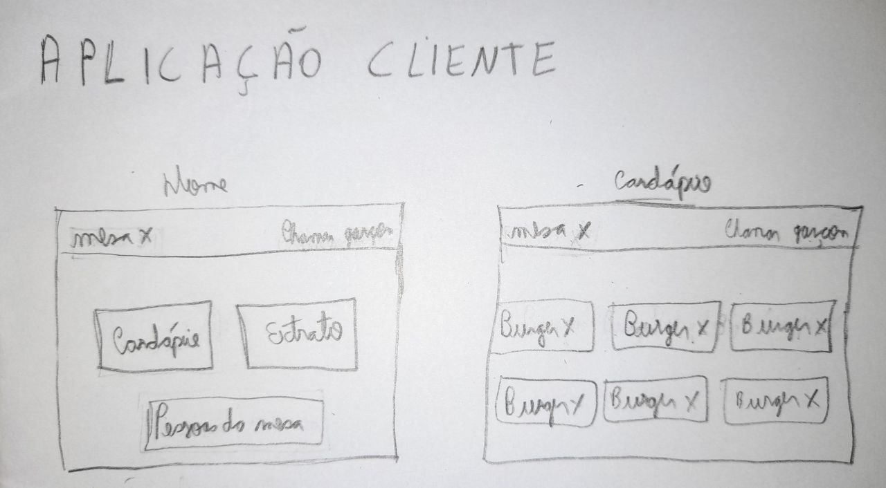
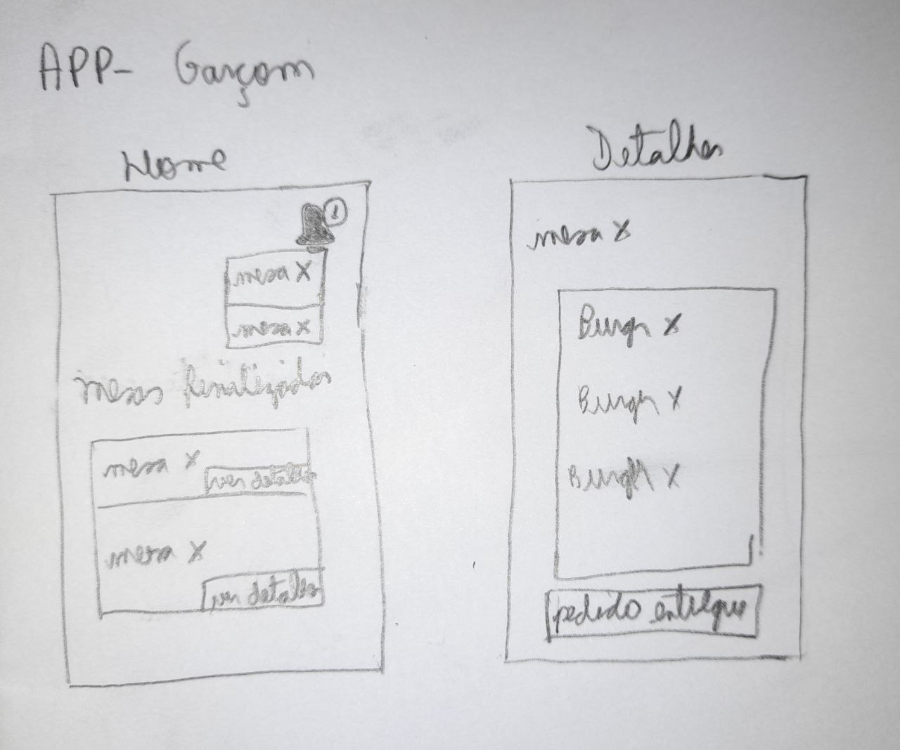

# Protótipo de baixa fidelidade

## 1. Introdução

&emsp;&emsp;O protótipo de baixa fidelidade é a melhor alternativa para um início de projeto, onde pode ser identificado problemas de usabilidade, pode-se testar conceitos da aplicação e descobrir o valor que o produto final pode gerar aos seus clientes.

&emsp;&emsp;O protótipo de baixa fidelidade é barato e rápido de fazer, além de servir como base para a criação de novos protótipos, com níveis maiores de fidelidade, durante o desenvolvimento do produto.

## 2. Protótipo

### 2.1 Aplicação Cliente

- Home e Cardápio
  

- Após selecionar cardápio, Detalhes dos pedidos e Extrato
  

### 2.2 App Garçom

- Home e Detalhes
  

### 2.3 Aplicação Cozinha

- Home e Detalhes
  

## 3. Referências

> - Protótipo de baixa fidelidade: o que é e como desenvolver em um projeto?. DigitalHouse, 27 abril. 2021. Disponível em: https://www.digitalhouse.com/br/blog/prototipo-de-baixa-fidelidade. Acesso em: 31 de Jul. 2021.

## Histórico de Revisões

| Data       | Versão | Descrição                                          | Autor(es)                                 |
| :--------- | :----- | :------------------------------------------------- | :---------------------------------------- |
| 31/07/2021 | 0.1    | Adição do documento e criação dos tópicos 1, 2 e 3 | [Emily Dias](https://github.com/emysdias) |
