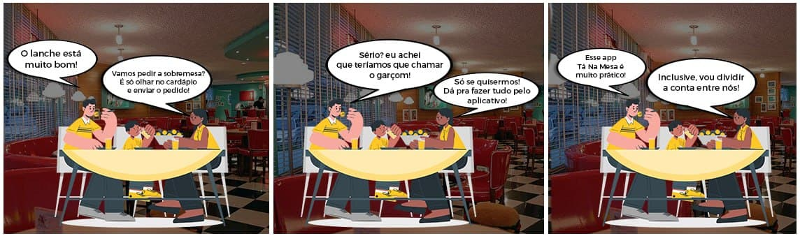
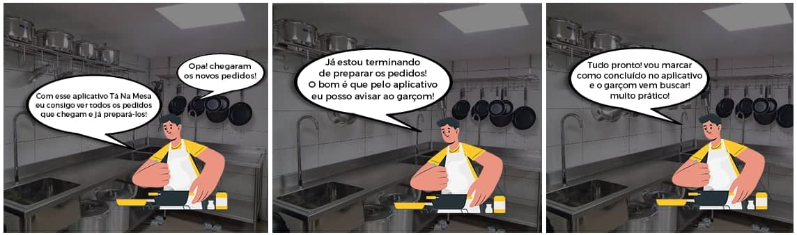

# Storytelling

## 1. Introdução

&emsp;&emsp;Storytelling é um termo em inglês, que significa contar história. É uma técnica de criação de narrativas, que também pode ser utilizada para que o engenheiro de software identifique o público alvo de seu projeto, qual é o problema que deve ser resolvido e como ele pode ser resolvido.

## 2. Histórias

### Cliente

João, Marcos e Jéssica são três amigos, eles se conhecem a um certo tempo e cada um tem cerca de 22 anos de idade. Gostam de sair no fim de semana para comer em restaurantes e lanchonetes, com uma certa frequência.

Em um certo final de semana, eles decidiram ir a Lanchonete BigBurgers, que é a preferida de Jéssica. Ao chegar, Jéssica mostra a João e Marcos que eles podem conferir o cardápio e pedir os lanches direto no aplicativo **Tá Na Mesa**, por um tablet que a lanchonete disponibiliza em cada mesa do local.

Depois de fazer o pedido e cada um comer o seu lanche, Marcos pensou que seria necessário chamar o garçom para pedir a sobremesa, porém, Jéssica o avisou que tudo pode ser feito pelo app. Após pedir as sobremesas, eles diviram a conta e pagaram, tudo pelo aplicativo. No fim, Marcos e João também aprovam a lanchonete pelo atendimento rápido e prático.

### Cozinheiro

O cozinheiro Leonardo trabalha na Lanchonete BigBurgers há 2 anos. Desde que entrou, ele sempre se preocupa com a pontualidade e a qualidade da preparação dos lanches.

Porém, ele precisava de mais organização nos pedidos que os clientes faziam e o garçom levava para ele.

Agora, ele recebe um pedido feito por um cliente pelo app e pode ver detalhes sobre esse pedido no mesmo instante, incluindo os ingredientes caso esqueça. E o garçom o recebe pronto para deixar na mesa.

### Gerente

O gerente e também dono da Lanchonete BigBurguers fundou a empresa há 5 anos. Ele é formado em Administração e se interessa por tecnologia e inovação onde trabalha. Também tem muita familirialidade com smartphones.

Há 6 meses ele descobriu o aplicativo **Tá na Mesa** enquanto navegava pela internet. Desde então, ele passou a gerir os processos de interesse da lanchonete pelo app.

Ele consegue gerenciar mesas, adicionar lanches no cardápio e verificar o pagamento da conta final de cada uma delas.

## 3. Referências

> - SERRANO, Maurício; SERRANO, Milene; Requisitos - Aula 07;

> - BOULILA, Naoufel; HOFFMANN, Anne; HERRMANN, Andrea. Using Storytelling to record requirements: Elements for an effective requirements elicitation approach. In: 2011 Fourth International Workshop on Multimedia and Enjoyable Requirements Engineering (MERE'11). IEEE, 2011. p. 9-16.

## Histórico de Revisões

| Data       | Versão | Descrição            | Autor(es)                                        |
| :--------- | :----- | :------------------- | :----------------------------------------------- |
| 31/07/2021 | 0.1    | Criação do documento | [Ítalo Alves](https://github.com/alvesitalo)     |
| 01/08/2021 | 0.2    | Adição dos tópicos   | [Ítalo Alves](https://github.com/alvesitalo)     |
| 02/08/2021 | 0.3    | Revisão do documento | [Daniel Primo](https://github.com/danieldagerom) |
